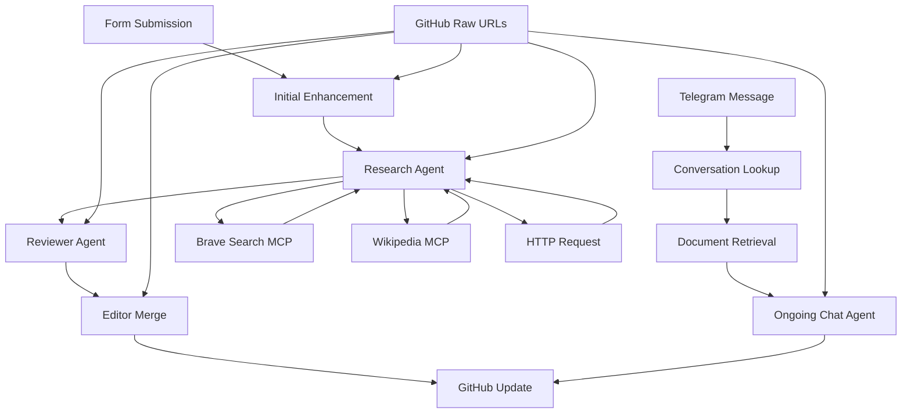

# n8n LLM Document Workflow

[](https://www.gnu.org/licenses/gpl-3.0)
[](https://github.com/Capp3/n8n-research-bug/actions/workflows/docs.yml)
[](https://github.com/Capp3/n8n-research-bug/actions/workflows/code-quality.yml)
[](https://github.com/Capp3/n8n-research-bug/actions/workflows/test.yml)
[](https://github.com/Capp3/n8n-research-bug/actions/workflows/scheduled-test.yml)

A sophisticated multi-agent AI workflow for document enhancement, research, and ongoing collaboration using n8n, LangChain, and Telegram integration.

## Overview

This project implements a comprehensive document processing pipeline that combines multiple AI agents to enhance, research, review, and iteratively improve documents. The workflow supports both initial document submission and ongoing collaborative editing through Telegram.

### Key Features

- **Multi-Agent Architecture**: Editor, Research, Reviewer, and Editor Merge agents with specialized roles
- **Two-Part Prompt System**: Hybrid system prompts (shared core + agent-specific addenda) with user prompt templates
- **Semantic Retrieval**: PostgreSQL with pgvector for context-aware research
- **GitHub Integration**: Automated file creation and updates with version control
- **Telegram Collaboration**: Ongoing document editing through chat interface
- **Research Enhancement**: Specialized MCP servers for research and data retrieval
- **Memory Persistence**: Conversation state management across sessions

## Quick Start

### Prerequisites

- n8n instance (self-hosted or cloud)
- OpenAI or Anthropic API access
- GitHub repository with API access
- PostgreSQL database with pgvector extension (or use `make docker-up`)
- Telegram bot (for ongoing collaboration)
- MCP servers for research and data retrieval (configured via Docker)

### Environment Setup

1. **Copy the sample environment file:**
   ```bash
   cp sample.env .env
   ```

2. **Start the services:**
   ```bash
   docker compose up -d
   ```

3. **Start the prompt server:**
   ```bash
   cd prompt-server
   npm install
   npm start
   ```

See [ENVIRONMENT_SETUP.md](ENVIRONMENT_SETUP.md) for detailed configuration instructions.

### Development Commands

The project includes a comprehensive Makefile with commands for all development tasks:

| Command | Description |
|---------|-------------|
| `make help` | Show all available commands with descriptions |
| `make setup` | Install dependencies and set up development environment |
| `make dev` | Complete development setup (setup + docker + serve-docs) |
| `make docker-up` | Start PostgreSQL, Redis, and Adminer containers |
| `make docker-health` | Check health status of all services |
| `make serve-docs` | Start MkDocs development server |
| `make test` | Run all tests (prompt-server + documentation) |
| `make status` | Show current project status and task progress |
| `make validate` | Validate project structure and configuration |

> **📋 Complete Command Reference**: See [Makefile Commands](docs/implementation/makefile-commands.md) for detailed documentation of all available commands.

### Installation

1. **Quick Setup**:
   ```bash
   # Complete development environment setup
   make setup && make dev
   ```

2. **Import Workflow**:
   ```bash
   # Import the workflow JSON into your n8n instance
   # See docs/implementation/setup-guide.md for detailed instructions
   ```

3. **Configure Environment**:
   ```bash
   # Set up required credentials and environment variables
   # See docs/implementation/configuration.md for details
   ```

4. **Start Support Services**:
   ```bash
   # Start PostgreSQL, Redis, and Adminer
   make docker-up
   ```

5. **Development Commands**:
   ```bash
   # Start prompt server in development mode
   make prompt-server
   
   # Build and serve documentation
   make serve-docs
   
   # Run all tests
   make test
   
   # View all available commands
   make help
   ```

### Basic Usage

1. **Initial Document Submission**:
   - Access the n8n form trigger
   - Submit your markdown document with research requirements
   - The workflow will enhance, research, and review your document
   - Final output is saved to your GitHub repository

2. **Ongoing Collaboration**:
   - Send messages to your Telegram bot
   - The workflow retrieves the current document
   - AI agents process your requests and update the document
   - Changes are committed to GitHub with detailed commit messages

## Documentation

### Live Documentation
- **📚 [Documentation Site](https://capp3.github.io/n8n-research-bug/)** - Complete documentation hosted on GitHub Pages
- **🔧 [Build Status](https://github.com/Capp3/n8n-research-bug/actions)** - Automated deployment status

### Core Documentation
- **[Project Overview](docs/projectbrief.md)** - Complete system architecture and logic flow
- **[Technical Summary](docs/technical.md)** - Key technical decisions and endpoints
- **[System Prompts](docs/system-prompts.md)** - AI agent prompt definitions

### Implementation Guides
- **[Setup Guide](docs/implementation/setup-guide.md)** - Complete n8n workflow setup
- **[Configuration](docs/implementation/configuration.md)** - Environment and credential setup
- **[Makefile Commands](docs/implementation/makefile-commands.md)** - Complete development command reference
- **[Testing](docs/implementation/testing.md)** - End-to-end testing procedures
- **[Variable Mapping](docs/implementation/variable-mapping.md)** - Complete variable reference
- **[GitHub Pages Deployment](docs/implementation/github-pages-deployment.md)** - Automated documentation deployment

### Creative Design
- **[UI/UX Design](docs/creative/uiux.md)** - User interface and experience decisions
- **[Architecture](docs/creative/architecture.md)** - System architecture and data flow
- **[Algorithms](docs/creative/algorithm.md)** - Core algorithms and implementation details
- **[Design Decisions](docs/creative/decisions.md)** - Key design choices and rationale

### Prompt System
- **[LLM Templates](docs/prompts/index.md)** - Available prompt templates
- **[Schema Reference](docs/prompts/schema.md)** - Template and index schemas
- **[Simplified Prompt System](prompts/README.md)** - Direct GitHub access with embedded system prompts

## Project Status

**Current Phase**: Implementation Complete, Ready for Testing

**Recent Updates**:
- ✅ Multi-agent architecture implemented
- ✅ Two-part prompt system (system + user templates)
- ✅ Variable mapping and workflow alignment
- ✅ HTTP GET endpoint structure for prompt retrieval
- ✅ Comprehensive testing framework
- 🔄 End-to-end testing in progress

**Next Steps**:
- Execute comprehensive testing procedures
- Integrate prompt server with n8n workflow
- Deploy and validate in production environment

## Project Structure

```
n8n-research-bug/
├── docs/                          # Complete documentation
│   ├── creative/                  # Design decisions and architecture
│   ├── implementation/            # Setup and configuration guides
│   ├── prompts/                   # LLM template documentation
│   ├── status/                    # Project status and progress
│   └── support/                   # Infrastructure documentation
├── prompt-server/                 # HTTP API for prompt retrieval
├── prompts/                       # LLM prompt templates
├── scripts/                       # Build and utility scripts
├── .github/workflows/             # CI/CD automation
├── compose.yml                    # Docker stack configuration
├── Makefile                       # Development commands
└── llm-document-workflow.json     # n8n workflow definition
```

## Architecture



## Contributing

This project follows a structured development approach:

1. **Creative Phase**: Design decisions and architecture
2. **Implementation Phase**: Code and configuration
3. **Testing Phase**: Validation and quality assurance
4. **Deployment Phase**: Production setup and monitoring

See [docs/tasks.md](docs/tasks.md) for current development status and [docs/progress.md](docs/progress.md) for detailed progress tracking.

## License

This project is licensed under the GNU General Public License v3.0 - see the [LICENSE](LICENSE) file for details.

## Support

For questions, issues, or contributions:
- Review the comprehensive documentation in the `docs/` directory
- Check the [testing procedures](docs/implementation/testing.md) for troubleshooting
- Refer to [variable mapping](docs/implementation/variable-mapping.md) for configuration issues
