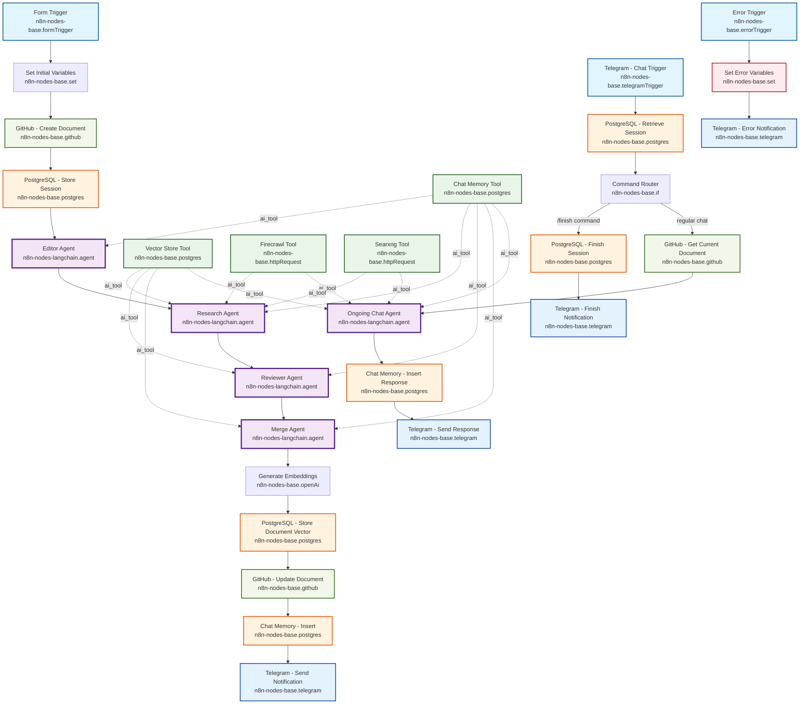

# AI Agent Workflow Plan - Research Bug System

## Overview
This workflow implements a conversational research assistant using n8n AI Agent nodes with tool connections for autonomous tool selection and MCP integration. Built for n8n v1.110.1 with RAG architecture using pgvector for document memory.

## Architecture Principles
- **AI Agent Nodes**: Use `n8n-nodes-langchain.agent` for all AI functionality
- **Tool Connections**: Connect tools to agents via agent tool connections
- **RAG Architecture**: pgvector for document embeddings, PostgreSQL for chat memory
- **MCP Integration**: Via tool connections to AI Agents
- **Error Handling**: Comprehensive error triggers and fallback mechanisms

## Complete Workflow Architecture



### Node Legend
- **🔵 Trigger Nodes**: Entry points (Form, Telegram Chat, Error)
- **🟣 AI Agent Nodes**: Core processing with tool connections
- **🟢 Tool Nodes**: Reusable tools connected to agents
- **🟠 Database Nodes**: PostgreSQL operations
- **🟢 GitHub Nodes**: Version control operations
- **🔵 Telegram Nodes**: User communication
- **🔴 Error Nodes**: Error handling and notifications

### Connection Types
- **Solid Lines**: Main workflow connections
- **Dotted Lines**: Tool connections to AI Agents (`ai_tool` type)
- **Conditional Branches**: Command Router splits chat vs finish flows

## Complete Node Inventory (29 Nodes)

### Main Processing Flow (13 nodes)
1. **Form Trigger** - Document submission interface
2. **Set Initial Variables** - Session and document metadata
3. **GitHub - Create Document** - Initial document storage
4. **PostgreSQL - Store Session** - Session lifecycle tracking
5. **Editor Agent** - Document structure enhancement
6. **Research Agent** - Knowledge expansion with citations
7. **Reviewer Agent** - Quality assessment and consistency
8. **Merge Agent** - Final document integration
9. **Generate Embeddings** - Document vectorization
10. **PostgreSQL - Store Document Vector** - RAG storage
11. **GitHub - Update Document** - Final document version
12. **Chat Memory - Insert** - Completion logging
13. **Telegram - Send Notification** - User notification

### Tool Nodes (4 nodes)
14. **Chat Memory Tool** - Conversation history access
15. **Vector Store Tool** - RAG document retrieval
16. **Firecrawl Tool** - Web crawling for research
17. **Searxng Tool** - Meta-search for research

### Ongoing Chat Flow (6 nodes)
18. **Telegram - Chat Trigger** - User message handling
19. **PostgreSQL - Retrieve Session** - Session lookup
20. **Command Router** - `/finish` vs regular chat routing
21. **PostgreSQL - Finish Session** - Session completion
22. **Telegram - Finish Notification** - Completion confirmation
23. **GitHub - Get Current Document** - Document retrieval
24. **Ongoing Chat Agent** - Conversation management
25. **Chat Memory - Insert Response** - Interaction logging
26. **Telegram - Send Response** - User response delivery

### Error Handling Flow (3 nodes)
27. **Error Trigger** - Workflow error detection
28. **Set Error Variables** - Error context formatting
29. **Telegram - Error Notification** - Admin error alerts

### Tool Connection Matrix
| Agent | Chat Memory | Vector Store | Firecrawl | Searxng |
|-------|-------------|--------------|-----------|---------|
| Editor Agent | ✅ | ❌ | ❌ | ❌ |
| Research Agent | ✅ | ✅ | ✅ | ✅ |
| Reviewer Agent | ✅ | ✅ | ❌ | ❌ |
| Merge Agent | ✅ | ✅ | ❌ | ❌ |
| Ongoing Chat Agent | ✅ | ✅ | ✅ | ✅ |

---

## Node-by-Node Implementation Plan

### 1. Form Trigger Node
**Type**: `n8n-nodes-base.formTrigger`  
**Purpose**: Initial document submission interface  
**Verification**: [n8n Form Trigger docs](https://docs.n8n.io/integrations/builtin/core-nodes/n8n-nodes-base.formtrigger/)

**Configuration**:
```
Parameters:
  formTitle: "Research Document Submission"
  formDescription: "Submit your document for AI-enhanced research and writing"
  formFields:
    values:
      - fieldLabel: "Document Title"
        fieldType: "text"
        fieldRequired: true
      - fieldLabel: "Initial Content" 
        fieldType: "textarea"
        fieldRequired: true
      - fieldLabel: "Research Focus"
        fieldType: "text"
        fieldRequired: false
      - fieldLabel: "Target Audience"
        fieldType: "select"
        fieldOptions:
          values:
            - option: "General"
            - option: "Technical"
            - option: "Academic"
```

**Output**: Form submission data with document details

---

### 2. Set Initial Variables Node
**Type**: `n8n-nodes-base.set`  
**Purpose**: Prepare session variables and document metadata  
**Verification**: [n8n Set node docs](https://docs.n8n.io/integrations/builtin/core-nodes/n8n-nodes-base.set/)

**Configuration**:
```
Parameters:
  values:
    string:
      - name: "document_id"
        value: "={{ $now.format('YYYY-MM-DD-HHmmss') }}-{{ $randomString(8) }}"
      - name: "session_id" 
        value: "={{ $randomString(16) }}"
      - name: "document_title"
        value: "={{ $json.title }}"
      - name: "initial_content"
        value: "={{ $json.content }}"
      - name: "research_focus"
        value: "={{ $json.research_focus || '' }}"
      - name: "target_audience"
        value: "={{ $json.target_audience }}"
      - name: "status"
        value: "processing"
      - name: "created_at"
        value: "={{ $now.toISO() }}"
```

**Output**: Enriched document metadata with session information

---

### 3. GitHub - Create Document Node
**Type**: `n8n-nodes-base.github`  
**Purpose**: Store initial document in version control  
**Verification**: [n8n GitHub node docs](https://docs.n8n.io/integrations/builtin/app-nodes/n8n-nodes-base.github/)

**Configuration**:
```
Parameters:
  operation: "create"
  owner: "={{ $workflow.settings.github_owner }}"
  repository: "={{ $workflow.settings.documents_repo }}"
  filePath: "documents/{{ $json.document_id }}.md"
  content: |
    # {{ $json.document_title }}
    
    {{ $json.initial_content }}
    
    ---
    *Created: {{ $json.created_at }}*
    *Status: {{ $json.status }}*
    *Session: {{ $json.session_id }}*
```

**Output**: GitHub file creation confirmation with commit details

---

### 4. PostgreSQL - Store Session Node
**Type**: `n8n-nodes-base.postgres`  
**Purpose**: Create session record for tracking  
**Verification**: [n8n PostgreSQL node docs](https://docs.n8n.io/integrations/builtin/app-nodes/n8n-nodes-base.postgres/)

**Configuration**:
```
Parameters:
  operation: "insert"
  table: "sessions"
  columns: "document_id, session_id, github_path, status, created_at, updated_at"
  values: "={{ $json.document_id }}, {{ $json.session_id }}, documents/{{ $json.document_id }}.md, active, {{ $json.created_at }}, {{ $json.created_at }}"
```

**Output**: Session record confirmation

---

### 5. Chat Memory Tool Node
**Type**: `n8n-nodes-base.postgres`  
**Purpose**: Tool for AI Agents to access conversation history  
**Verification**: [n8n PostgreSQL node docs](https://docs.n8n.io/integrations/builtin/app-nodes/n8n-nodes-base.postgres/)

**Configuration**:
```
Parameters:
  operation: "select"
  table: "chat_memory"
  where: "session_id = '{{ $json.session_id }}'"
  orderBy: "created_at ASC"
  limit: 50
```

**Tool Connection**: Connected to AI Agent nodes as tool
**Output**: Chat history for agent context

---

### 6. Vector Store Tool Node  
**Type**: `n8n-nodes-base.postgres`  
**Purpose**: RAG tool for document embeddings retrieval  
**Verification**: [n8n PostgreSQL node docs](https://docs.n8n.io/integrations/builtin/app-nodes/n8n-nodes-base.postgres/)

**Configuration**:
```
Parameters:
  operation: "executeQuery"
  query: |
    SELECT content, metadata, 
           1 - (embedding <=> $1) as similarity
    FROM document_vectors 
    WHERE 1 - (embedding <=> $1) > 0.7
    ORDER BY similarity DESC 
    LIMIT 10
```

**Tool Connection**: Connected to AI Agent nodes as tool
**Output**: Relevant document chunks with similarity scores

---

### 7. Firecrawl Tool Node
**Type**: `n8n-nodes-base.httpRequest`  
**Purpose**: Web crawling tool for research agents  
**Verification**: [n8n HTTP Request node docs](https://docs.n8n.io/integrations/builtin/core-nodes/n8n-nodes-base.httprequest/)

**Configuration**:
```
Parameters:
  method: "POST"
  url: "={{ $workflow.settings.mcp_firecrawl_url }}/crawl"
  headers:
    Content-Type: "application/json"
    Authorization: "Bearer {{ $workflow.settings.mcp_firecrawl_token }}"
  body:
    url: "={{ $parameter.url }}"
    options:
      formats: ["markdown"]
      includeTags: ["article", "main", "content"]
      excludeTags: ["nav", "footer", "aside"]
```

**Tool Connection**: Connected to Research and Chat AI Agents
**Output**: Crawled webpage content in markdown format

---

### 8. Searxng Tool Node
**Type**: `n8n-nodes-base.httpRequest`  
**Purpose**: Meta-search tool for research agents  
**Verification**: [n8n HTTP Request node docs](https://docs.n8n.io/integrations/builtin/core-nodes/n8n-nodes-base.httprequest/)

**Configuration**:
```
Parameters:
  method: "GET"
  url: "={{ $workflow.settings.mcp_searxng_url }}/search"
  headers:
    Content-Type: "application/json"
  queryParameters:
    q: "={{ $parameter.query }}"
    format: "json"
    engines: "google,bing,duckduckgo"
```

**Tool Connection**: Connected to Research and Chat AI Agents
**Output**: Search results with URLs and snippets

---

### 9. Editor AI Agent Node
**Type**: `n8n-nodes-langchain.agent`  
**Purpose**: Document structure and style enhancement  
**Verification**: [n8n AI Agent docs](https://docs.n8n.io/integrations/builtin/cluster-nodes/root-nodes/n8n-nodes-langchain.agent/)

**Configuration**:
```
Parameters:
  systemMessage: |
    You are an expert editor specializing in document structure and clarity.
    
    Your responsibilities:
    1. Structure Enhancement: Improve organization, headings, flow
    2. Style Refinement: Ensure clarity and appropriate tone
    3. Content Gaps: Identify areas needing research
    4. Citation Format: Maintain proper citation standards
    
    Target audience: {{ $node['Set Initial Variables'].json['target_audience'] }}
    
    Use the Chat Memory tool to understand conversation context.
    Focus on structural improvements while preserving author's voice.
  
  chatModel: 
    model: "gpt-4"
    temperature: 0.3
    maxTokens: 2000
```

**Tool Connections**:
- Chat Memory Tool (conversation context)

**Input**: Document title, content, research focus
**Output**: Enhanced document with structural improvements

---

### 10. Research AI Agent Node
**Type**: `n8n-nodes-langchain.agent`  
**Purpose**: Knowledge expansion and fact verification  
**Verification**: [n8n AI Agent docs](https://docs.n8n.io/integrations/builtin/cluster-nodes/root-nodes/n8n-nodes-langchain.agent/)

**Configuration**:
```
Parameters:
  systemMessage: |
    You are a research specialist focused on knowledge expansion and verification.
    
    Your responsibilities:
    1. Research Enhancement: Find authoritative sources
    2. Fact Verification: Verify claims with credible citations  
    3. Knowledge Gaps: Fill information gaps with sourced content
    4. Source Quality: Prioritize academic and official sources
    5. Tool Selection: Choose appropriate research tools:
       - URLs to crawl → Use Firecrawl tool
       - Search queries → Use Searxng tool
       - Document context → Use Vector Store tool
       - Chat history → Use Chat Memory tool
    
    Always provide inline citations in [URL](source) format.
    Avoid social media; prefer documented, authoritative materials.
  
  chatModel:
    model: "gpt-4"
    temperature: 0.4
    maxTokens: 3000
```

**Tool Connections**:
- Firecrawl Tool (web crawling)
- Searxng Tool (meta-search)
- Vector Store Tool (document RAG)
- Chat Memory Tool (conversation context)

**Input**: Editor's enhanced document
**Output**: Research-enhanced document with citations

---

### 11. Reviewer AI Agent Node
**Type**: `n8n-nodes-langchain.agent`  
**Purpose**: Quality assessment and consistency checking  
**Verification**: [n8n AI Agent docs](https://docs.n8n.io/integrations/builtin/cluster-nodes/root-nodes/n8n-nodes-langchain.agent/)

**Configuration**:
```
Parameters:
  systemMessage: |
    You are a quality reviewer specializing in document assessment.
    
    Your responsibilities:
    1. Quality Assessment: Evaluate content accuracy and completeness
    2. Consistency Check: Ensure tone, style, and formatting
    3. Citation Verification: Check citation format and accessibility
    4. Improvement Suggestions: Provide actionable recommendations
    
    Use Chat Memory to understand the document evolution process.
    Use Vector Store to reference similar quality standards.
    Focus on constructive feedback while preserving document value.
  
  chatModel:
    model: "gpt-4"
    temperature: 0.2
    maxTokens: 2500
```

**Tool Connections**:
- Chat Memory Tool (conversation context)
- Vector Store Tool (quality standards reference)

**Input**: Research-enhanced document
**Output**: Quality assessment with recommendations

---

### 12. Merge AI Agent Node
**Type**: `n8n-nodes-langchain.agent`  
**Purpose**: Final document integration and polish  
**Verification**: [n8n AI Agent docs](https://docs.n8n.io/integrations/builtin/cluster-nodes/root-nodes/n8n-nodes-langchain.agent/)

**Configuration**:
```
Parameters:
  systemMessage: |
    You are a document integration specialist creating the final version.
    
    Your responsibilities:
    1. Content Integration: Merge all improvements cohesively
    2. Final Polish: Ensure natural flow and readability
    3. Citation Management: Organize citations consistently  
    4. Quality Assurance: Deliver publication-ready document
    
    Use Chat Memory to understand the full improvement process.
    Use Vector Store to reference best practices for final documents.
    Create the definitive version incorporating all enhancements.
  
  chatModel:
    model: "gpt-4"
    temperature: 0.1
    maxTokens: 4000
```

**Tool Connections**:
- Chat Memory Tool (conversation context)
- Vector Store Tool (best practices reference)

**Input**: Editor, Research, and Reviewer outputs
**Output**: Final polished document

---

### 13. Generate Embeddings Node
**Type**: `n8n-nodes-base.openAi`  
**Purpose**: Create embeddings for final document (RAG storage)  
**Verification**: [n8n OpenAI node docs](https://docs.n8n.io/integrations/builtin/app-nodes/n8n-nodes-base.openai/)

**Configuration**:
```
Parameters:
  resource: "embedding" 
  model: "text-embedding-ada-002"
  input: "={{ $json.output }}"
```

**Input**: Final document content
**Output**: Document embeddings vector

---

### 14. PostgreSQL - Store Document Vector Node
**Type**: `n8n-nodes-base.postgres`  
**Purpose**: Store document embeddings in vector database  
**Verification**: [n8n PostgreSQL node docs](https://docs.n8n.io/integrations/builtin/app-nodes/n8n-nodes-base.postgres/)

**Configuration**:
```
Parameters:
  operation: "insert"
  table: "document_vectors"
  columns: "document_id, content, embedding, metadata, created_at"
  values: "={{ $node['Set Initial Variables'].json['document_id'] }}, {{ $node['Merge AI Agent'].json['output'] }}, {{ $json.data[0].embedding }}, {{ JSON.stringify({title: $node['Set Initial Variables'].json['document_title'], session_id: $node['Set Initial Variables'].json['session_id']}) }}, {{ $now.toISO() }}"
```

**Input**: Document content and embeddings
**Output**: Vector storage confirmation

---

### 15. GitHub - Update Document Node
**Type**: `n8n-nodes-base.github`  
**Purpose**: Save final document version  
**Verification**: [n8n GitHub node docs](https://docs.n8n.io/integrations/builtin/app-nodes/n8n-nodes-base.github/)

**Configuration**:
```
Parameters:
  operation: "edit"
  owner: "={{ $workflow.settings.github_owner }}"
  repository: "={{ $workflow.settings.documents_repo }}" 
  filePath: "documents/{{ $node['Set Initial Variables'].json['document_id'] }}.md"
  content: "={{ $node['Merge AI Agent'].json['output'] }}"
  commitMessage: "AI-enhanced document: {{ $node['Set Initial Variables'].json['document_title'] }}"
```

**Input**: Final document content
**Output**: Updated GitHub file with commit details

---

### 16. Chat Memory - Insert Node
**Type**: `n8n-nodes-base.postgres`  
**Purpose**: Store completion message in chat memory  
**Verification**: [n8n PostgreSQL node docs](https://docs.n8n.io/integrations/builtin/app-nodes/n8n-nodes-base.postgres/)

**Configuration**:
```
Parameters:
  operation: "insert"
  table: "chat_memory"
  columns: "session_id, role, content, created_at"
  values: "={{ $node['Set Initial Variables'].json['session_id'] }}, system, Document processing completed: {{ $node['Set Initial Variables'].json['document_title'] }}, {{ $now.toISO() }}"
```

**Input**: Session information
**Output**: Chat memory confirmation

---

### 17. Telegram - Send Notification Node
**Type**: `n8n-nodes-base.telegram`  
**Purpose**: Notify user of completion  
**Verification**: [n8n Telegram node docs](https://docs.n8n.io/integrations/builtin/app-nodes/n8n-nodes-base.telegram/)

**Configuration**:
```
Parameters:
  operation: "sendMessage"
  chatId: "={{ $workflow.settings.telegram_chat_id }}"
  text: |
    ✅ **Document Processing Complete!**
    
    📄 **{{ $node['Set Initial Variables'].json['document_title'] }}**
    🔗 **View**: https://github.com/{{ $workflow.settings.github_owner }}/{{ $workflow.settings.documents_repo }}/blob/main/documents/{{ $node['Set Initial Variables'].json['document_id'] }}.md
    
    💬 **Continue the conversation** to refine the document
    🏁 **Type `/finish`** to complete the development cycle
```

**Input**: Document metadata
**Output**: Telegram message confirmation

---

## Ongoing Chat Flow

### 18. Telegram - Chat Trigger Node
**Type**: `n8n-nodes-base.telegramTrigger`  
**Purpose**: Handle ongoing user messages  
**Verification**: [n8n Telegram Trigger docs](https://docs.n8n.io/integrations/builtin/trigger-nodes/n8n-nodes-base.telegramtrigger/)

**Configuration**:
```
Parameters:
  updates: ["message"]
  additionalFields:
    filters:
      chat_id: "={{ $workflow.settings.telegram_chat_id }}"
```

**Output**: User message data

---

### 19. PostgreSQL - Retrieve Session Node
**Type**: `n8n-nodes-base.postgres`  
**Purpose**: Get active session for user  
**Verification**: [n8n PostgreSQL node docs](https://docs.n8n.io/integrations/builtin/app-nodes/n8n-nodes-base.postgres/)

**Configuration**:
```
Parameters:
  operation: "select"
  table: "sessions"
  where: "telegram_user_id = '{{ $json.message.from.id }}' AND status = 'active'"
  orderBy: "updated_at DESC"
  limit: 1
```

**Input**: Telegram user ID
**Output**: Active session data

---

### 20. Command Router Node
**Type**: `n8n-nodes-base.if`  
**Purpose**: Route `/finish` commands vs regular chat  
**Verification**: [n8n IF node docs](https://docs.n8n.io/integrations/builtin/core-nodes/n8n-nodes-base.if/)

**Configuration**:
```
Parameters:
  conditions:
    string:
      - value1: "={{ $json.message.text }}"
        operation: "startsWith"
        value2: "/finish"
```

**Output**: 
- True: Finish command flow
- False: Continue chat flow

---

### 21. PostgreSQL - Finish Session Node
**Type**: `n8n-nodes-base.postgres`  
**Purpose**: Mark session as completed  
**Verification**: [n8n PostgreSQL node docs](https://docs.n8n.io/integrations/builtin/app-nodes/n8n-nodes-base.postgres/)

**Configuration**:
```
Parameters:
  operation: "update"
  table: "sessions"
  updateKey: "session_id"
  updateKeyValue: "={{ $node['PostgreSQL - Retrieve Session'].json.session_id }}"
  columns: "status, updated_at"
  values: "completed, {{ $now.toISO() }}"
```

**Input**: Session ID
**Output**: Update confirmation

---

### 22. Telegram - Finish Notification Node
**Type**: `n8n-nodes-base.telegram`  
**Purpose**: Confirm session completion  
**Verification**: [n8n Telegram node docs](https://docs.n8n.io/integrations/builtin/app-nodes/n8n-nodes-base.telegram/)

**Configuration**:
```
Parameters:
  operation: "sendMessage"
  chatId: "={{ $json.message.chat.id }}"
  text: |
    🏁 **Development Cycle Complete!**
    
    Your document has been finalized and saved.
    Thank you for using the Research Bug system!
```

**Input**: Telegram chat data
**Output**: Completion message

---

### 23. GitHub - Get Current Document Node
**Type**: `n8n-nodes-base.github`  
**Purpose**: Retrieve current document for chat context  
**Verification**: [n8n GitHub node docs](https://docs.n8n.io/integrations/builtin/app-nodes/n8n-nodes-base.github/)

**Configuration**:
```
Parameters:
  operation: "get"
  owner: "={{ $workflow.settings.github_owner }}"
  repository: "={{ $workflow.settings.documents_repo }}"
  filePath: "={{ $node['PostgreSQL - Retrieve Session'].json.github_path }}"
```

**Input**: GitHub path from session
**Output**: Current document content

---

### 24. Ongoing Chat AI Agent Node
**Type**: `n8n-nodes-langchain.agent`  
**Purpose**: Manage ongoing conversation and document iteration  
**Verification**: [n8n AI Agent docs](https://docs.n8n.io/integrations/builtin/cluster-nodes/root-nodes/n8n-nodes-langchain.agent/)

**Configuration**:
```
Parameters:
  systemMessage: |
    You are the ongoing conversation manager for the Research Bug system.
    
    Your responsibilities:
    1. Conversation Continuity: Maintain context across sessions
    2. Iterative Improvement: Help users refine documents
    3. Clarification: Ask questions when needed
    4. Action Coordination: Determine when updates are needed
    5. Session Management: Inform users about `/finish` command
    
    Use all available tools to assist the user:
    - Chat Memory: Access conversation history
    - Vector Store: Reference document context and similar content
    - Firecrawl: Research new information when needed
    - Searxng: Find additional sources
    
    Always reference document context and conversation history.
  
  chatModel:
    model: "gpt-4"
    temperature: 0.3
    maxTokens: 2000
```

**Tool Connections**:
- Chat Memory Tool (conversation history)
- Vector Store Tool (document context)
- Firecrawl Tool (web research)
- Searxng Tool (search capabilities)

**Input**: User message, document context, chat history
**Output**: Conversational response with potential actions

---

### 25. Chat Memory - Insert Response Node
**Type**: `n8n-nodes-base.postgres`  
**Purpose**: Store chat interaction in memory  
**Verification**: [n8n PostgreSQL node docs](https://docs.n8n.io/integrations/builtin/app-nodes/n8n-nodes-base.postgres/)

**Configuration**:
```
Parameters:
  operation: "insert"
  table: "chat_memory"
  columns: "session_id, role, content, created_at"
  values: "={{ $node['PostgreSQL - Retrieve Session'].json.session_id }}, user, {{ $node['Telegram - Chat Trigger'].json.message.text }}, {{ $now.toISO() }}"
```

**Input**: User message and session data
**Output**: Memory storage confirmation

---

### 26. Telegram - Send Response Node
**Type**: `n8n-nodes-base.telegram`  
**Purpose**: Send AI response to user  
**Verification**: [n8n Telegram node docs](https://docs.n8n.io/integrations/builtin/app-nodes/n8n-nodes-base.telegram/)

**Configuration**:
```
Parameters:
  operation: "sendMessage"
  chatId: "={{ $json.message.chat.id }}"
  text: "={{ $node['Ongoing Chat AI Agent'].json.output }}"
  additionalFields:
    parseMode: "Markdown"
```

**Input**: AI Agent response
**Output**: Telegram message confirmation

---

## Error Handling

### 27. Error Trigger Node
**Type**: `n8n-nodes-base.errorTrigger`  
**Purpose**: Catch workflow errors  
**Verification**: [n8n Error Trigger docs](https://docs.n8n.io/integrations/builtin/core-nodes/n8n-nodes-base.errortrigger/)

**Configuration**:
```
Parameters:
  triggerOn: "workflowError"
```

**Output**: Error information and context

---

### 28. Set Error Variables Node
**Type**: `n8n-nodes-base.set`  
**Purpose**: Prepare error information  
**Verification**: [n8n Set node docs](https://docs.n8n.io/integrations/builtin/core-nodes/n8n-nodes-base.set/)

**Configuration**:
```
Parameters:
  values:
    string:
      - name: "error_message"
        value: "={{ $json.error.message }}"
      - name: "error_node"
        value: "={{ $json.error.node }}"
      - name: "error_timestamp"
        value: "={{ $now.toISO() }}"
      - name: "session_id"
        value: "={{ $json.session_id || 'unknown' }}"
```

**Input**: Error context
**Output**: Formatted error data

---

### 29. Telegram - Error Notification Node
**Type**: `n8n-nodes-base.telegram`  
**Purpose**: Notify of system errors  
**Verification**: [n8n Telegram node docs](https://docs.n8n.io/integrations/builtin/app-nodes/n8n-nodes-base.telegram/)

**Configuration**:
```
Parameters:
  operation: "sendMessage"
  chatId: "={{ $workflow.settings.telegram_admin_chat_id }}"
  text: |
    ❌ **Workflow Error**
    
    **Node**: {{ $json.error_node }}
    **Error**: {{ $json.error_message }}
    **Time**: {{ $json.error_timestamp }}
    **Session**: {{ $json.session_id }}
    
    Please check workflow execution for details.
```

**Input**: Error information
**Output**: Admin notification

---

## Database Schema

### Sessions Table
```sql
CREATE TABLE sessions (
  id SERIAL PRIMARY KEY,
  document_id VARCHAR(255) UNIQUE NOT NULL,
  session_id VARCHAR(255) UNIQUE NOT NULL,
  telegram_user_id VARCHAR(255),
  github_path TEXT NOT NULL,
  status VARCHAR(50) DEFAULT 'active',
  created_at TIMESTAMP DEFAULT CURRENT_TIMESTAMP,
  updated_at TIMESTAMP DEFAULT CURRENT_TIMESTAMP
);
```

### Chat Memory Table
```sql
CREATE TABLE chat_memory (
  id SERIAL PRIMARY KEY,
  session_id VARCHAR(255) NOT NULL,
  role VARCHAR(50) NOT NULL,
  content TEXT NOT NULL,
  created_at TIMESTAMP DEFAULT CURRENT_TIMESTAMP,
  FOREIGN KEY (session_id) REFERENCES sessions(session_id)
);
```

### Document Vectors Table (RAG)
```sql
CREATE EXTENSION IF NOT EXISTS vector;

CREATE TABLE document_vectors (
  id SERIAL PRIMARY KEY,
  document_id VARCHAR(255) NOT NULL,
  content TEXT NOT NULL,
  embedding vector(1536),
  metadata JSONB,
  created_at TIMESTAMP DEFAULT CURRENT_TIMESTAMP,
  FOREIGN KEY (document_id) REFERENCES sessions(document_id)
);

CREATE INDEX ON document_vectors USING ivfflat (embedding vector_cosine_ops);
```

## Workflow Settings Required

```json
{
  "github_owner": "capp3",
  "documents_repo": "writing",
  "workflow_repo": "n8n-research-bug",
  "mcp_firecrawl_url": "http://localhost:3001",
  "mcp_firecrawl_token": "your-firecrawl-token",
  "mcp_searxng_url": "http://localhost:3002",
  "telegram_chat_id": "your-telegram-chat-id",
  "telegram_admin_chat_id": "admin-telegram-chat-id"
}
```

## Connections Summary

### Main Processing Flow
1. Form Trigger → Set Initial Variables → GitHub Create → PostgreSQL Store Session
2. Editor Agent (with Chat Memory) → Research Agent (with all tools) → Reviewer Agent (with Chat Memory + Vector Store) → Merge Agent (with Chat Memory + Vector Store)
3. Generate Embeddings → Store Document Vector → GitHub Update → Chat Memory Insert → Telegram Notification

### Chat Flow  
1. Telegram Chat Trigger → Retrieve Session → Command Router
2. If `/finish`: Finish Session → Finish Notification
3. If regular chat: Get Document → Ongoing Chat Agent (with all tools) → Insert Response → Send Response

### Error Flow
1. Error Trigger → Set Error Variables → Telegram Error Notification

This architecture provides:
- ✅ Proper AI Agent nodes with tool connections
- ✅ RAG architecture with pgvector
- ✅ MCP integration via tool connections
- ✅ Comprehensive error handling
- ✅ Chat memory persistence
- ✅ Document version control
- ✅ Session management
