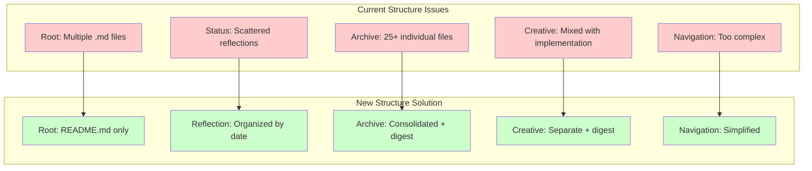

# Document Refactoring Architecture Design

## 🎨 CREATIVE PHASE: ARCHITECTURE DESIGN

**Date**: 2025-01-28  
**Task**: Document Refactoring  
**Phase**: Architecture Design  

## PROBLEM STATEMENT

The current documentation structure has several critical issues:
1. **Root Directory Pollution**: Multiple .md files in root directory (only README.md should remain)
2. **Scattered Reflection Files**: Reflection documents spread across `docs/status/` without organization
3. **Excessive Archive Files**: 25+ individual archive files creating navigation complexity
4. **Mixed Content Types**: Creative, implementation, and archive content not properly separated
5. **Navigation Overload**: MkDocs navigation too complex with too many individual items
6. **Information Duplication**: Similar content across multiple files without clear consolidation strategy

## OPTIONS ANALYSIS

### Option 1: Minimal Restructure (Conservative Approach)
**Description**: Move only root files, create basic reflection folder, minimal archive consolidation
**Pros**:
- Low risk of breaking existing links
- Quick implementation
- Minimal disruption to current workflow
**Cons**:
- Doesn't solve navigation complexity
- Archive files remain scattered
- Creative docs still mixed with implementation
- Doesn't address information duplication
**Complexity**: Low
**Implementation Time**: 2-3 hours

### Option 2: Comprehensive Restructure (Balanced Approach)
**Description**: Complete folder reorganization with digest views, consolidated archives, organized reflections
**Pros**:
- Clean separation of concerns
- Simplified navigation
- Better information organization
- Digest views reduce complexity
- Preserves all information while improving accessibility
**Cons**:
- Requires careful link updating
- More complex implementation
- Risk of breaking some internal references
**Complexity**: Medium
**Implementation Time**: 6-8 hours

### Option 3: Radical Simplification (Aggressive Approach)
**Description**: Merge most files into comprehensive documents, eliminate individual archive files
**Pros**:
- Dramatically simplified structure
- Minimal navigation items
- Single source of truth for each topic
**Cons**:
- High risk of information loss
- Difficult to find specific historical information
- May break existing workflows
- Loses granular access to specific topics
**Complexity**: High
**Implementation Time**: 10-12 hours

## DECISION

**Selected Approach: Option 2 - Comprehensive Restructure (Balanced Approach)**

**Rationale**:
- Addresses all identified problems without information loss
- Provides clear separation between active and archived content
- Implements digest views to reduce navigation complexity
- Maintains granular access while improving organization
- Balances thoroughness with implementation feasibility

## IMPLEMENTATION PLAN

### New Folder Structure Design:
```
docs/
├── README.md (moved from root)
├── archive/
│   ├── index.md (digest view)
│   ├── comprehensive-archives/
│   │   ├── n8n-refactoring-consolidated.md
│   │   ├── prompt-system-consolidated.md
│   │   └── mcp-integration-consolidated.md
│   └── individual-files/ (unique content only)
├── creative/
│   ├── index.md (digest view)
│   ├── design-decisions-consolidated.md
│   └── process-documentation-consolidated.md
├── reflection/
│   ├── index.md (digest view)
│   ├── 2025-01-28/
│   │   ├── n8n-patterns-refactoring.md
│   │   ├── prompt-simplification.md
│   │   └── mcp-refactoring.md
│   └── consolidated-insights.md
├── implementation/ (active docs - no changes)
├── status/ (Memory Bank - no changes)
└── contributing/ (active docs - no changes)
```

### Key Design Principles:
1. **Separation of Concerns**: Clear distinction between active and archived content
2. **Information Preservation**: All information preserved through consolidation
3. **Navigation Simplification**: Digest views reduce complexity
4. **Scalability**: Structure supports future content growth
5. **User Experience**: Clear hierarchy with overview → detail access pattern

## VISUALIZATION



## CREATIVE PHASE COMPLETE

✅ **Architecture Design**: New folder structure with clear separation of concerns  
✅ **Implementation Guidelines**: Detailed structure design  
✅ **Visualization**: Clear diagrams showing current issues and solutions  

**Next Phase**: UI/UX Design for navigation and digest view design
