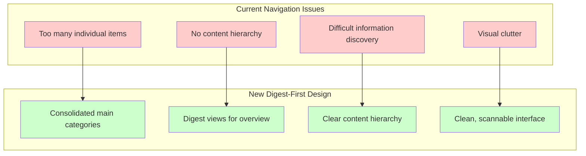

# Document Refactoring UI/UX Design

## 🎨 CREATIVE PHASE: UI/UX DESIGN

**Date**: 2025-01-28  
**Task**: Document Refactoring  
**Phase**: UI/UX Design  

## PROBLEM STATEMENT

The current MkDocs navigation and content presentation has several UX issues:
1. **Navigation Overload**: Too many individual items in navigation menu
2. **Information Discovery**: Difficult to find specific historical information
3. **Content Hierarchy**: No clear distinction between active and archived content
4. **Digest Access**: No consolidated view of related information
5. **Visual Clutter**: Individual archive files create visual noise
6. **User Journey**: Unclear path for users seeking specific information types

## OPTIONS ANALYSIS

### Option 1: Hierarchical Navigation (Tree Structure)
**Description**: Multi-level navigation with expandable sections
**Pros**:
- Clear content hierarchy
- Organized by topic and type
- Familiar tree navigation pattern
- Good for power users
**Cons**:
- Can become complex with many levels
- May hide important content
- Not mobile-friendly
- Requires more clicks to access content
**Complexity**: Medium
**Implementation Time**: 4-5 hours

### Option 2: Tab-Based Navigation (Category Tabs)
**Description**: Main categories as tabs with sub-navigation
**Pros**:
- Clean, modern interface
- Clear content separation
- Good for different user types
- Mobile-friendly
**Cons**:
- Limited to main categories
- May not scale well
- Requires careful category design
**Complexity**: Medium
**Implementation Time**: 3-4 hours

### Option 3: Digest-First Navigation (Consolidated Views)
**Description**: Primary navigation shows digest views, detailed content accessible via links
**Pros**:
- Reduces navigation complexity
- Provides overview before detail
- Excellent for information discovery
- Scales well with content growth
- Mobile-optimized
**Cons**:
- Requires careful digest design
- May require additional clicks for specific content
- Needs clear information architecture
**Complexity**: Medium-High
**Implementation Time**: 5-6 hours

## DECISION

**Selected Approach: Option 3 - Digest-First Navigation (Consolidated Views)**

**Rationale**:
- Best addresses navigation overload issue
- Provides excellent information discovery experience
- Scales well as content grows
- Mobile-friendly design
- Aligns with user needs for both overview and detail access

## IMPLEMENTATION PLAN

### Digest View Design:

#### Archive Digest (`docs/archive/index.md`):
```markdown
# Archive Digest

## Major Refactoring Projects
- **n8n Patterns Refactoring (2025-01-28)**: Complete workflow modernization
- **Prompt System Simplification (2025-01-28)**: 95% complexity reduction
- **MCP Server Refactoring (2025-01-28)**: Research-focused integration


### Navigation Structure:
```yaml
nav:
  - Home: index.md
  - Project Brief: projectbrief.md
  - Quick Start: QUICK_START.md
  - Implementation:
      - Overview: implementation/index.md
      - Setup Guide: implementation/setup-guide.md
      - [other implementation docs]
  - Archive: archive/index.md
  - Reflection: reflection/index.md
  - Creative: creative/index.md
  - Contributing:
      - Overview: contributing/index.md
      - [other contributing docs]
```

### Key UX Principles:
1. **Progressive Disclosure**: Overview → Detail access pattern
2. **Information Hierarchy**: Clear content categorization
3. **Mobile Optimization**: Responsive design considerations
4. **Searchability**: Easy content discovery
5. **Consistency**: Uniform navigation patterns

## VISUALIZATION



## CREATIVE PHASE COMPLETE

✅ **UI/UX Design**: Digest-first navigation with consolidated views  
✅ **Navigation Strategy**: Simplified structure with clear hierarchy  
✅ **User Experience**: Overview → detail access pattern  
✅ **Implementation Guidelines**: Detailed digest view designs  

**Next Phase**: IMPLEMENT MODE for execution of the designed structure
