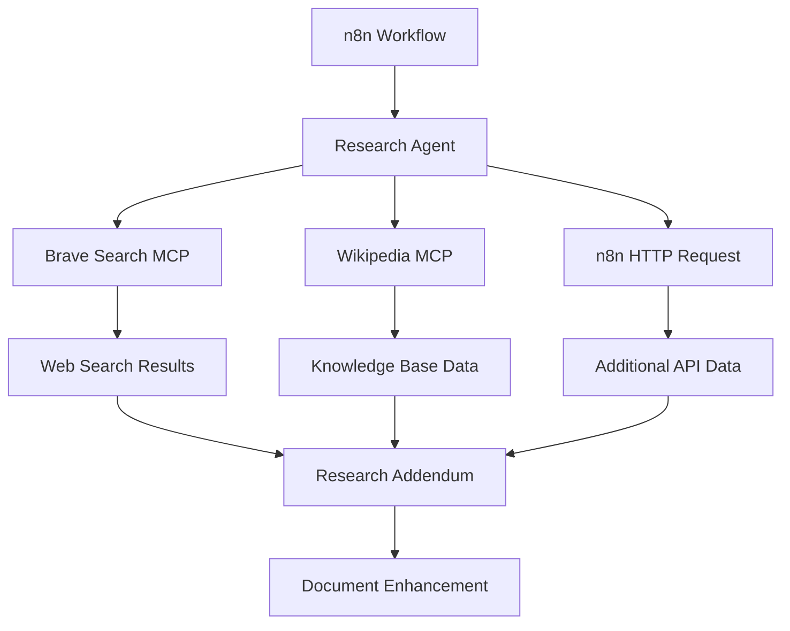

# MCP Servers for Research and Data Retrieval

## Overview

This document provides detailed information about the Model Context Protocol (MCP) servers integrated into the n8n Research Bug project. These servers enhance the research capabilities of the workflow by providing specialized tools for web search, knowledge base access, and workflow assistance.

## MCP Server Architecture

The n8n Research Bug project uses a balanced approach to MCP integration, combining specialized MCP servers with n8n's native HTTP Request capabilities. This architecture provides enhanced research capabilities while maintaining simplicity and leveraging n8n's strengths.



## Integrated MCP Servers

### 1. Brave Search MCP

**Purpose**: Provides comprehensive web search capabilities with high-quality, privacy-focused results.

**Docker Configuration**:
```yaml
# Brave Search MCP Server - Web search capabilities
mcp-brave-search:
  image: ghcr.io/yourusername/mcp-brave-search:latest
  restart: unless-stopped
  container_name: mcp-brave-search
  networks:
    - support_network
  ports:
    - ${BRAVE_SEARCH_PORT:-3002}:3000
  environment:
    BRAVE_API_KEY: ${BRAVE_API_KEY}
  healthcheck:
    test: ["CMD", "curl", "-f", "http://localhost:3000/health"]
    interval: 30s
    timeout: 10s
    retries: 3
```

**Environment Variables**:
- `BRAVE_API_KEY`: API key for Brave Search (required)
- `BRAVE_SEARCH_PORT`: Port for the MCP server (default: 3002)

**API Endpoints**:
- `POST /search`: Search the web
  - Parameters:
    - `query` (string): The search query
    - `count` (number, optional): Number of results to return (default: 10)
    - `country` (string, optional): Country code for localized results
    - `language` (string, optional): Language code for results

**Usage Example**:
```json
{
  "parameters": {
    "url": "=http://mcp-brave-search:3000/search",
    "method": "POST",
    "sendHeaders": true,
    "headerParameters": {
      "parameters": [
        {
          "name": "Content-Type",
          "value": "application/json"
        }
      ]
    },
    "sendBody": true,
    "bodyParameters": {
      "parameters": [
        {
          "name": "query",
          "value": "={{$json.research_query}}"
        },
        {
          "name": "count",
          "value": 10
        }
      ]
    }
  },
  "name": "Brave Search MCP"
}
```

### 2. Wikipedia MCP

**Purpose**: Provides access to Wikipedia's knowledge base for factual information and references.

**Docker Configuration**:
```yaml
# Wikipedia MCP Server - Knowledge base access
mcp-wikipedia:
  image: ghcr.io/yourusername/mcp-wikipedia:latest
  restart: unless-stopped
  container_name: mcp-wikipedia
  networks:
    - support_network
  ports:
    - ${WIKIPEDIA_PORT:-3003}:3000
  healthcheck:
    test: ["CMD", "curl", "-f", "http://localhost:3000/health"]
    interval: 30s
    timeout: 10s
    retries: 3
```

**Environment Variables**:
- `WIKIPEDIA_PORT`: Port for the MCP server (default: 3003)

**API Endpoints**:
- `POST /search`: Search Wikipedia articles
  - Parameters:
    - `query` (string): The search query
    - `limit` (number, optional): Number of results to return (default: 5)
    - `language` (string, optional): Language code (default: 'en')
- `POST /article`: Get a specific Wikipedia article
  - Parameters:
    - `title` (string): The article title
    - `language` (string, optional): Language code (default: 'en')

**Usage Example**:
```json
{
  "parameters": {
    "url": "=http://mcp-wikipedia:3000/search",
    "method": "POST",
    "sendHeaders": true,
    "headerParameters": {
      "parameters": [
        {
          "name": "Content-Type",
          "value": "application/json"
        }
      ]
    },
    "sendBody": true,
    "bodyParameters": {
      "parameters": [
        {
          "name": "query",
          "value": "={{$json.research_query}}"
        },
        {
          "name": "limit",
          "value": 5
        }
      ]
    }
  },
  "name": "Wikipedia MCP"
}
```

### 3. n8n-MCP (Optional)

**Purpose**: AI-powered n8n workflow builder and assistant.

**Docker Configuration**:
```yaml
# n8n-MCP Server - AI-powered n8n workflow builder
n8n-mcp:
  image: ghcr.io/czlonkowski/n8n-mcp:latest
  restart: unless-stopped
  container_name: n8n-mcp
  networks:
    - support_network
  ports:
    - ${N8N_MCP_PORT:-3001}:3001
  environment:
    # Database connection
    DATABASE_URL: postgresql://${SUPPORT_POSTGRES_USER:-support-user}:${SUPPORT_POSTGRES_PASSWORD:-support-password}@n8n-postgres:5432/${SUPPORT_POSTGRES_DB:-support}
    # MCP Server configuration
    MCP_SERVER_PORT: ${N8N_MCP_PORT:-3001}
    MCP_SERVER_HOST: ${N8N_MCP_HOST:-0.0.0.0}
    # n8n API configuration
    N8N_API_URL: ${N8N_API_URL:-http://n8n:5678}
    N8N_API_KEY: ${N8N_API_KEY}
    # Optional: n8n docs path for enhanced node information
    N8N_DOCS_PATH: ${N8N_DOCS_PATH:-/app/n8n-docs}
    # Logging and debug
    LOG_LEVEL: ${N8N_MCP_LOG_LEVEL:-info}
    DEBUG: ${N8N_MCP_DEBUG:-false}
  healthcheck:
    test: ["CMD", "curl", "-f", "http://localhost:3001/health || exit 1"]
    interval: 30s
    timeout: 10s
    retries: 3
```

**Environment Variables**:
- `N8N_MCP_PORT`: Port for the MCP server (default: 3001)
- `N8N_MCP_HOST`: Host for the MCP server (default: 0.0.0.0)
- `N8N_API_URL`: URL for the n8n API (required)
- `N8N_API_KEY`: API key for n8n (required)
- `N8N_DOCS_PATH`: Path to n8n documentation (optional)
- `N8N_MCP_LOG_LEVEL`: Log level (default: info)
- `N8N_MCP_DEBUG`: Enable debug mode (default: false)

**Features**:
- **Natural Language Interface**: Describe workflows in plain English
- **Node Discovery**: Find appropriate nodes for specific tasks
- **Workflow Validation**: Validate workflows before deployment
- **Configuration Assistance**: Get help with node settings and parameters

## Integration with n8n Workflow

### Research Agent Prompt

The Research Agent is configured to use the MCP servers through a specialized prompt:

```
You are a Research Agent with access to specialized MCP tools.

AVAILABLE TOOLS:
- Brave Search: Web search and current information
- Wikipedia: Factual knowledge and references
- n8n HTTP Request: For additional API access

CONTEXT (retrieved):
{{$json.retrieved_context || ''}}

GOAL:
- Produce a research_addendum (markdown) with citations and comparative tables relevant to the user's requirements and current draft.
- Keep to facts; add links and references.

INPUTS:
- Project: {{$json.project_name}}
- Research scope: {{$json.research_scope}}
- Current draft (from Editor): {{$json.output || $json.parsed_content || ''}}

OUTPUT:
- Return ONLY markdown addendum suitable for direct insertion, with inline links and a References section at the end.
```

### Workflow Integration

The MCP servers are integrated into the n8n workflow through HTTP Request nodes:

1. **Research Query Generation**: The workflow generates research queries based on the document content
2. **MCP Server Requests**: The queries are sent to the appropriate MCP servers
3. **Result Processing**: The results are processed and formatted for the Research Agent
4. **Research Addendum Creation**: The Research Agent creates a research addendum using the MCP server results
5. **Document Enhancement**: The research addendum is integrated into the final document

## Setting Up MCP Servers

### Prerequisites

- Docker and Docker Compose installed
- Brave Search API key (for Brave Search MCP)
- n8n instance with API key (for n8n-MCP, optional)

### Installation Steps

1. **Update Environment Variables**:
   - Copy `sample.env` to `.env` if not already done
   - Add your Brave Search API key to `.env`:
     ```
     BRAVE_API_KEY=your-brave-api-key
     ```
   - If using n8n-MCP, add your n8n API key:
     ```
     N8N_API_KEY=your-n8n-api-key
     N8N_API_URL=http://your-n8n-instance:5678
     ```

2. **Start the Services**:
   ```bash
   docker compose up -d
   ```

3. **Verify MCP Server Health**:
   ```bash
   docker compose ps
   ```

   All services should be in the "Up" state with health checks passing.

### Obtaining API Keys

#### Brave Search API Key

1. Go to [Brave Search API](https://brave.com/search/api/)
2. Sign up for an API key
3. Add the API key to your `.env` file

## Troubleshooting

### Common Issues

1. **MCP Server Not Responding**:
   - Check that the Docker container is running: `docker compose ps`
   - Verify network connectivity: `docker compose exec mcp-brave-search ping n8n-postgres`
   - Check logs for errors: `docker compose logs mcp-brave-search`

2. **API Key Issues**:
   - Verify that the API key is correctly set in the `.env` file
   - Check that the API key has not expired or reached its quota

3. **n8n Integration Issues**:
   - Verify that the n8n API URL is correct
   - Check that the n8n API key has the necessary permissions

## Best Practices

1. **Rate Limiting**: Be mindful of API rate limits, especially for Brave Search
2. **Query Optimization**: Use specific, focused queries for better results
3. **Error Handling**: Implement proper error handling in the workflow
4. **Caching**: Consider caching frequently used search results to reduce API calls
5. **Monitoring**: Regularly check MCP server logs for issues

