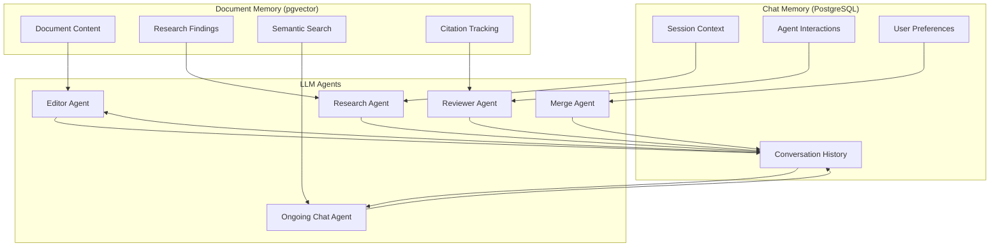
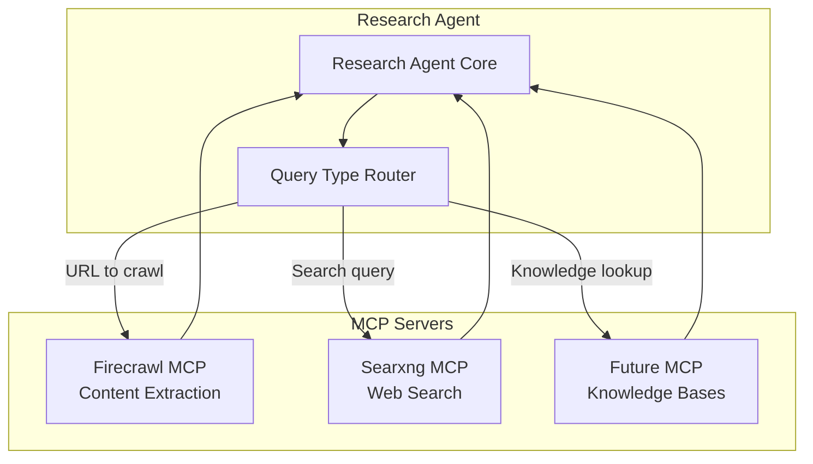
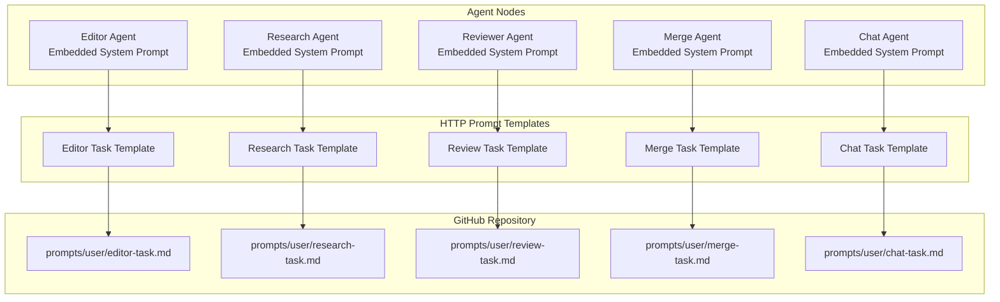
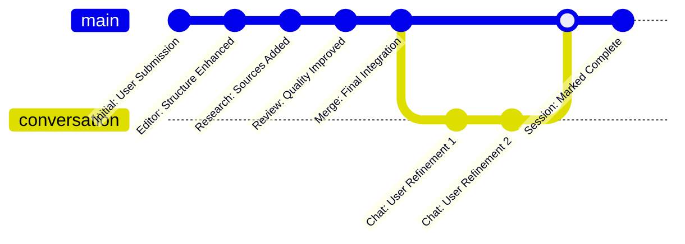
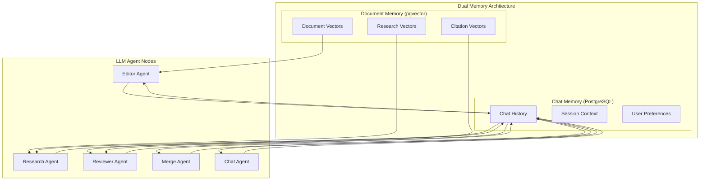
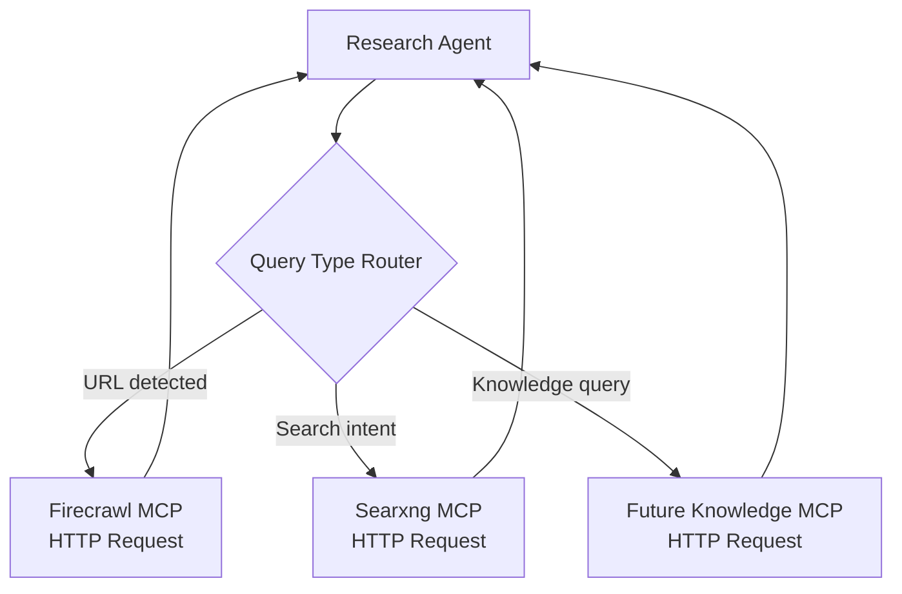
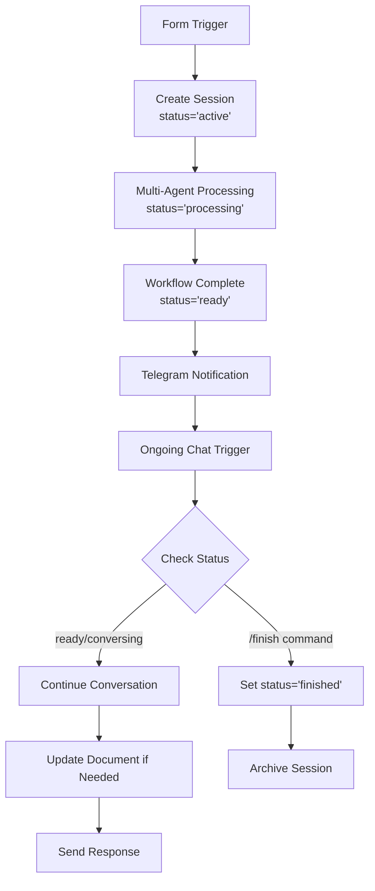

# 🎨 CREATIVE PHASE: ARCHITECTURE DESIGN

## Problem Statement

The n8n workflow plan requires architectural decisions for memory management, MCP integration, session handling, prompt management, and document evolution tracking to ensure robust, scalable implementation.

## Architecture Options Analysis

### 1. Memory Architecture (DECISION: Dual Memory System)

#### Selected Option: Dual Memory Architecture
**Description**: Two independent memory systems serving different purposes
- **pgvector Database**: Document and research information storage with semantic search
- **Chat Memory**: Direct connection to LLM agent node memory tool for conversation context

**Architecture Design**:


**Implementation Considerations**:
- pgvector stores document evolution, research data, embeddings for semantic search
- PostgreSQL chat memory wires directly to n8n LLM Agent memory connections
- Clear separation of concerns: documents vs conversations
- Agents can access both memories as needed

### 2. MCP Integration Pattern (DECISION: Independent Direct Access)

#### Selected Option: Intelligent Routing with Direct Access
**Description**: Each LLM agent has direct access to relevant MCP servers with intelligent routing based on query type

**Architecture Design**:


**Query Routing Logic**:
- **URL pattern detected** → Firecrawl MCP
- **Search intent keywords** → Searxng MCP  
- **Knowledge base queries** → Future knowledge MCP
- **Parallel queries** → Multiple MCPs simultaneously

**Implementation Considerations**:
- Research Agent system prompt includes MCP selection logic
- Each MCP connection is independent HTTP Request node
- Agent decides which tools to use based on research needs
- No complex orchestration layer needed

### 3. Session Management Architecture (DECISION: Simple Session Lookup)

#### Selected Option: Single Document Session with Lifecycle Management
**Description**: Simple session tracking by Telegram user ID with document lifecycle controls

**Session Lifecycle Design**:
```mermaid
stateDiagram-v2
    [*] --> Active : Document Submitted
    Active --> Processing : AI Enhancement
    Processing --> Ready : Enhancement Complete
    Ready --> Conversing : User Continues Chat
    Conversing --> Ready : Agent Response
    Conversing --> Finished : /finish command
    Ready --> Finished : /finish command
    Finished --> [*] : Session Archived
    
    note right of Active : PostgreSQL: status='active'
    note right of Processing : PostgreSQL: status='processing'
    note right of Ready : PostgreSQL: status='ready'
    note right of Conversing : PostgreSQL: status='conversing'
    note right of Finished : PostgreSQL: status='finished'
```

**Session Management Schema**:
```sql
CREATE TABLE sessions (
    session_id VARCHAR(16) PRIMARY KEY,
    telegram_user_id BIGINT NOT NULL,
    document_id VARCHAR(32) NOT NULL,
    status VARCHAR(20) DEFAULT 'active',
    created_at TIMESTAMP DEFAULT NOW(),
    finished_at TIMESTAMP NULL,
    github_path TEXT,
    INDEX idx_telegram_user (telegram_user_id),
    INDEX idx_status (status)
);
```

**Lifecycle Commands**:
- **Auto**: Form submission → Active
- **Auto**: Processing complete → Ready  
- **User**: `/finish` → Finished
- **System**: 30 days inactive → Auto-finish

### 4. Prompt Management Strategy (DECISION: Hybrid Approach)

#### Selected Option: System Embedded + User Templates via HTTP
**Description**: System prompts embedded in agents, user/task templates fetched dynamically

**Prompt Architecture**:


**Implementation Pattern**:
- **System Prompts**: Embedded directly in n8n agent nodes (role definition, behavior)
- **User Prompts**: HTTP fetched from GitHub (task-specific instructions, variable templates)
- **Prompt Assembly**: System + User + Context variables in agent execution

### 5. Document Evolution Tracking (DECISION: GitHub Commit History)

#### Selected Option: Simple GitHub-based Evolution Tracking
**Description**: Leverage GitHub's native version control for document evolution with meaningful commit messages

**Evolution Tracking Pattern**:


**Commit Message Convention**:
- `Initial: [document_title]` - Form submission
- `Editor: [enhancement_summary]` - Editor agent changes
- `Research: [research_summary]` - Research agent additions
- `Review: [review_summary]` - Reviewer agent improvements
- `Merge: [integration_summary]` - Merge agent final version
- `Chat: [user_change_summary]` - Ongoing conversation updates
- `Session: Marked Complete` - /finish command executed

## Implementation Architecture Updates

Based on these decisions, here are the key architecture updates needed:

### Updated Memory Flow


### Updated MCP Integration


### Session Lifecycle Implementation


## Validation Against Requirements

✅ **Memory Architecture**: Dual system supports both document intelligence and conversation context
✅ **MCP Integration**: Direct access with intelligent routing for research quality
✅ **Session Management**: Simple lifecycle with clear completion mechanism
✅ **Prompt Management**: Hybrid approach balances flexibility and maintainability  
✅ **Document Evolution**: GitHub commits provide clear evolution tracking

## Implementation Checklist

- [ ] Update workflow plan with dual memory architecture
- [ ] Design MCP routing logic for Research Agent
- [ ] Create session lifecycle state management
- [ ] Design prompt template directory structure
- [ ] Define commit message conventions
- [ ] Update database schema for session management
- [ ] Create `/finish` command handling logic

🎨🎨🎨 EXITING CREATIVE PHASE - ARCHITECTURE DECISIONS COMPLETE 🎨🎨🎨
