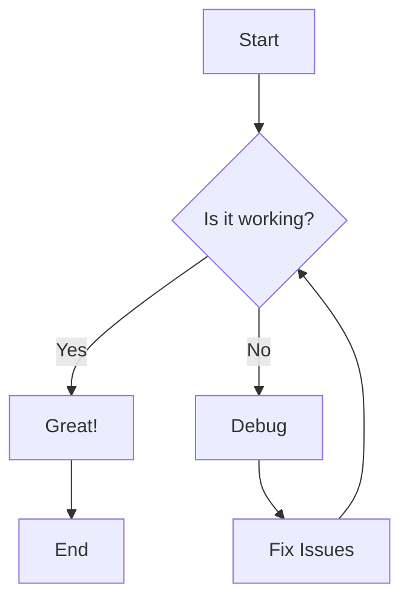
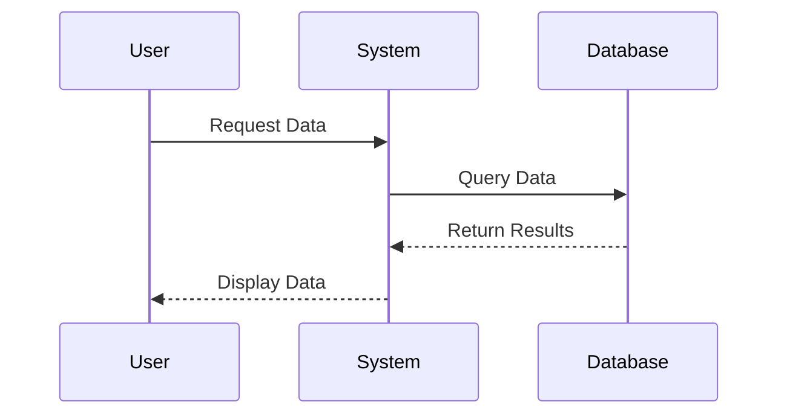
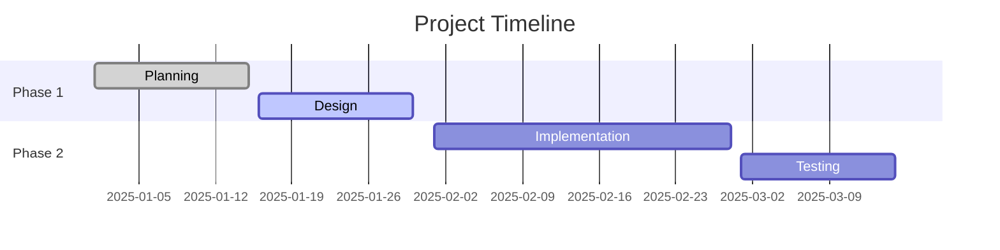
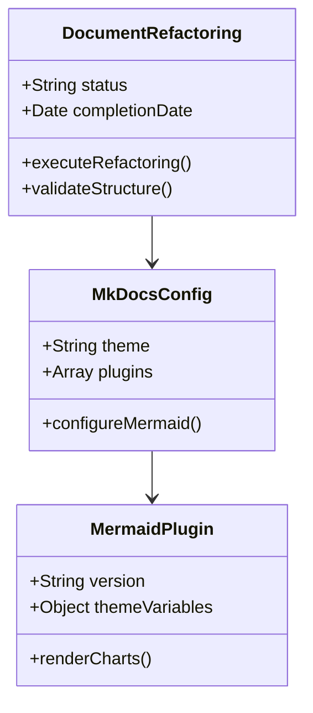
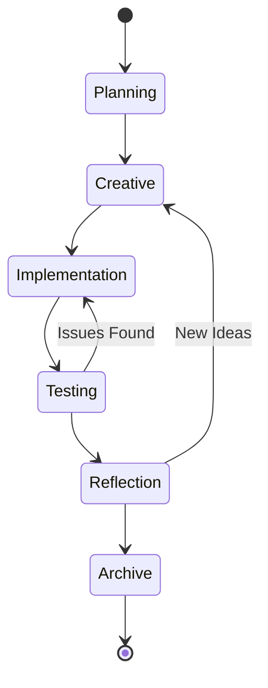
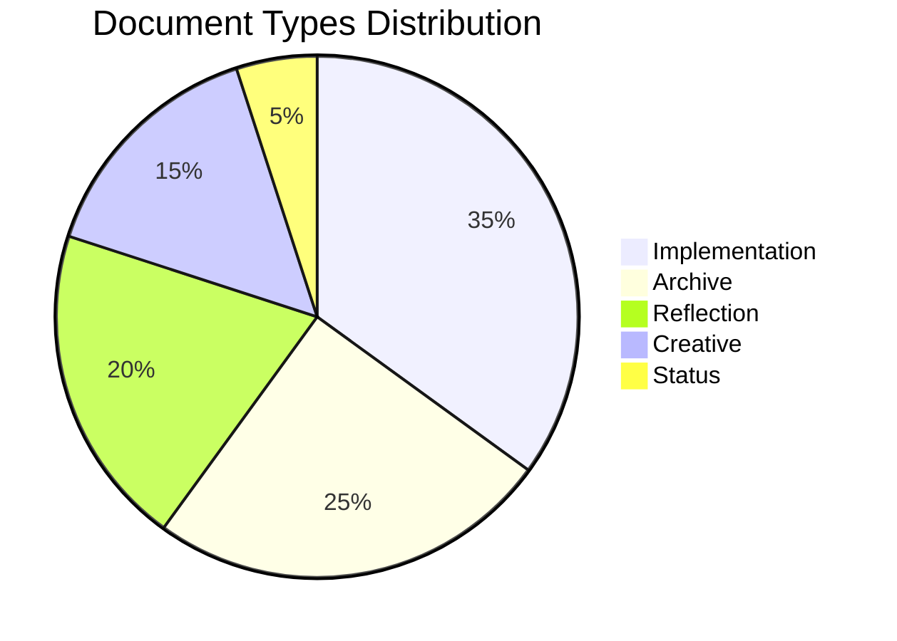
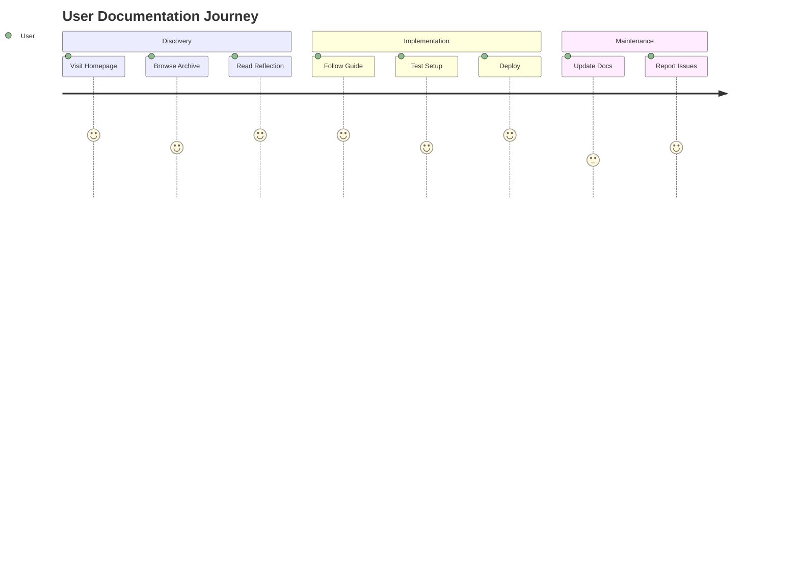
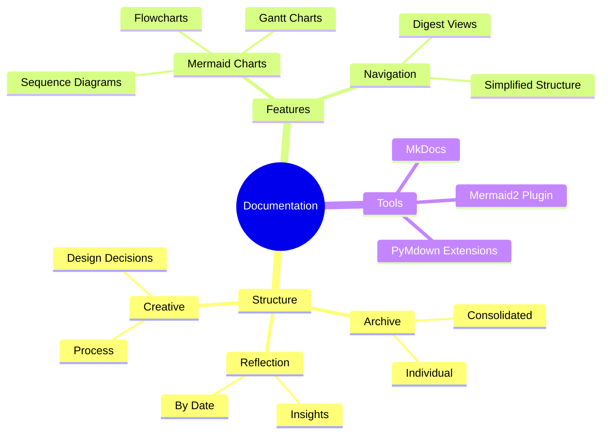
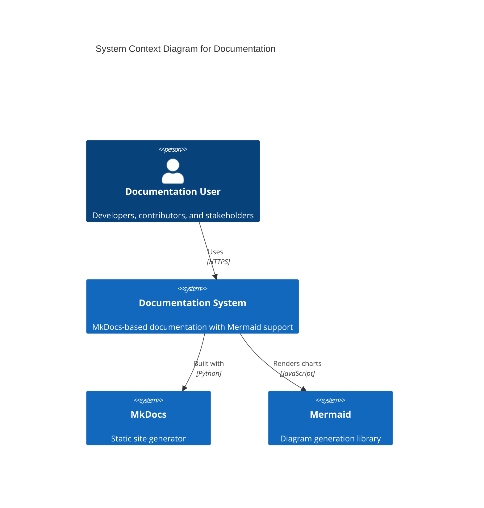

# Mermaid Test Documentation

This document demonstrates the Mermaid chart functionality in our updated MkDocs configuration.

## Flowchart Example



## Sequence Diagram Example



## Gantt Chart Example



## Class Diagram Example



## State Diagram Example



## Pie Chart Example



## Git Graph Example

```mermaid
gitgraph
    commit id: "Initial"
    commit id: "Add Mermaid"
    branch feature
    checkout feature
    commit id: "Update Config"
    checkout main
    merge feature
    commit id: "Release"
```

## Journey Diagram Example



## Mindmap Example



## C4 Context Diagram Example



This demonstrates the full range of Mermaid diagram types supported by our updated MkDocs configuration.
