# n8n LLM Document Conversation – Project Brief (Form → Telegram)

## Overview

This project creates an n8n workflow to:

1. Accept a markdown document, project name, and personal thoughts via **n8n form**.
2. Store the initial document in **GitHub**.
3. Use a specialised pair of prompts per agent: a system prompt (shared or agent-specific) and an agent user prompt template. For the initial run, include the required Submission Brief.
4. Continue the conversation through Telegram with the agent user prompt template; keep using the system prompt; pass Writing Style Instructions each iteration.
5. Parse LLM responses to selectively update the document in GitHub.
6. Maintain conversation and document state across sessions.

## Logic Flow

```mermaid
graph TD
  A[Form Submission] --> B[Generate Conversation ID]
  B --> C[GitHub Create File]
  C --> D[AI: Initial Enhancement]

  %% Retrieval pipeline
  D --> RQ[Build Retrieval Query]
  RQ --> EMB[Embed Retrieval Query]
  EMB --> PG[Postgres Similarity Search]
  PG --> FRC[Format Retrieved Context]
  FRC --> E[AI: Research]

  %% Context7 Analyzer
  E --> X[Context7 MCP: Document Analyzer]
  X --> V[AI: Reviewer]
  V --> M[AI: Editor Merge]

  %% Validation and commit
  M --> P[Parse & Validate]
  P -->|pass| G[GitHub Update]
  P -->|fail| H[Telegram Error Notification]

  %% Ongoing chat loop
  G --> T[Telegram Ongoing Chat]
  H --> T
  T --> LUP[Conversation Lookup]
  LUP --> RC[GitHub Read Current]
  RC --> OC[AI: Ongoing Chat]
  OC --> PV[Parse & Validate (Ongoing)]
  PV --> GU[GitHub Update (Ongoing)]
  GU --> SN[Telegram Success Notification]

  %% Memory connections (conceptual)
  subgraph Memory
    MBW[Memory Buffer Window (k=10)]
  end
  MBW -.-> D
  MBW -.-> E
  MBW -.-> V
  MBW -.-> M
  MBW -.-> OC
```

## Context7 Integration

- Set `CONTEXT7_API_BASE` to your reachable Context7 deployment (do not rely on the fallback `https://context7.local`).
- Analyzer endpoint: `/mcp/document/analyze` on your base URL.
- The Research agent sends the addendum to Context7 for validation; the Reviewer consumes the analyzer response.

Payload example sent by the analyzer node:

```json
{
  "content": "<markdown addendum>",
  "project": "<project_name>",
  "scope": "<research_scope>"
}
```

See `docs/implementation/setup-guide.md` for authentication options and reverse-proxy guidance.

## Multi-Agent Architecture

The workflow uses three specialized agents with shared memory (session `conversation_id`):

* **Editor Agent**: Owns structure and final markdown; merges research and review notes.
* **Research Agent**: Gathers facts, generates comparative tables, and returns citations.
* **Reviewer Agent**: Performs style/consistency checks and raises quality flags.

Only the Research Agent is tool-enabled (MCP/web search/regulatory DB). Editor and Reviewer remain deterministic for stable formatting.

## Node Flow (n8n)

```mermaid
graph LR
  F[Document Editor Form] --> GCID[Generate Conversation ID]
  GCID --> GHCreate[GitHub Create File]
  GHCreate --> AI1[AI Agent - Initial Enhancement]

  AI1 --> BRQ[Build Retrieval Query]
  BRQ --> EMB[Embed Retrieval Query]
  EMB --> PG[Postgres Similarity Search]
  PG --> FRC[Format Retrieved Context]
  FRC --> AIR[AI Agent - Research]
  AIR --> C7[Context7 MCP - Document Analyzer]
  C7 --> ARV[AI Agent - Reviewer]
  ARV --> AIM[AI Agent - Editor Merge]
  AIM --> PARSE[Parse Initial Output]
  PARSE --> IF{Validation Check}
  IF -->|true| GHU1[GitHub Update - Initial]
  IF -->|false| TErr[Error Notification]
  GHU1 --> STORE[Store Conversation State]

  TTrig[Telegram Trigger] --> LOOKUP[Conversation Lookup]
  LOOKUP --> GHREAD[GitHub Read Current]
  GHREAD --> AIO[AI Agent - Ongoing Chat]
  AIO --> PARSEO[Parse Ongoing Output]
  PARSEO --> GHU2[GitHub Update - Ongoing]
  GHU2 --> TSuc[Success Notification]

  MBW[Memory Buffer Window] -. ai_memory .-> AI1
  MBW -. ai_memory .-> AIR
  MBW -. ai_memory .-> ARV
  MBW -. ai_memory .-> AIM
  MBW -. ai_memory .-> AIO
```



## Parameter Table

| Parameter              | Source           | Purpose                                        |
| ---------------------- | ---------------- | ---------------------------------------------- |
| `project_name`         | Form Input       | GitHub filename & Conversation ID reference    |
| `markdown_document`    | Form Input       | Initial content to edit                        |
| `personal_thoughts`    | Form Input       | Research requirements and expansion requests   |
| `research_scope`       | Form Input       | Research level: basic/comprehensive/regulatory |
| `github_owner`         | Form Input       | GitHub username for document repository        |
| `github_repo`          | Form Input       | GitHub repository name for document storage    |
| `conversation_id`      | Function Node    | Links form and Telegram chats                 |
| `created_at`           | Function Node    | Timestamp for workflow initialization          |
| `workflow_state`       | Function Node    | Current state tracking                         |
| `chat_id`              | Telegram Trigger | Identifies Telegram user                       |
| `system_prompt`        | Static Template  | Formatting and research standards for LLM     |
| `agent_user_prompt`    | Function Node    | Agent user prompt template (varies by step)   |
| `submission_brief`     | Form Input       | Required brief provided with initial document |
| `style_instructions`   | Form Input       | Optional writing style instructions to apply  |
| `llm_response`         | OpenRouter       | Raw LLM response with markdown content         |
| `parsed_content`       | Parser Node      | Cleaned and validated markdown output          |
| `word_count`           | Parser Node      | Document length tracking                       |
| `has_structure`        | Parser Node      | Boolean flag for proper document structure     |
| `has_toc`              | Parser Node      | Boolean flag for table of contents presence   |
| `structure_score`      | Parser Node      | Quality score for document structure (0-1)    |
| `completeness_score`   | Parser Node      | Quality score for content completeness (0-1)  |
| `validation_passed`    | Parser Node      | Boolean flag for output quality validation     |
| `ai_agent_used`        | Parser Node      | Boolean flag for AI Agent node usage          |
| `research_enhanced`    | Parser Node      | Boolean flag for content enhancement          |
| `research_addendum`    | Research Agent   | Additional researched content (markdown)       |
| `citations`            | Research Agent   | Array of citation objects/links                |
| `reviewer_notes`       | Reviewer Agent   | QA notes (markdown bullets)                    |
| `quality_flags`        | Reviewer Agent   | Object of issues found (structure/tone/etc.)   |
| `change_description`   | Parser Node      | Description of edits for commit messages       |
| `edit_type`            | Parser Node      | Type of edit: initial/telegram_chat           |
| `telegram_message`     | Telegram Trigger | User's ongoing edit requests via chat         |

## AI Agent Prompt Templates

> Note: These prompts are designed for iterative improvement with focused clarifying questions, explicit JSON variable usage, memory, and MCP tools. Paste into the relevant AI Agent nodes and map `{{ }}` variables to `{{$json...}}` in n8n.

### AI Agent System Context (Built into all AI Agent nodes)

The AI Agent nodes are configured with professional document editing and research capabilities:

- Professional markdown standards and accessible tone
- Conversation memory via Memory Buffer Window (session: `{{$json.conversation_id}}`)
- Tool usage for web/regulatory research and Context7 Analyzer validation
- Deterministic behavior for QA/Merge; slightly creative for initial editing/research
- Always read the entire current document before writing
- Maintain author’s tone; extend it consistently
- Work in small focused sections guided by a grand plan
- Include mermaid diagrams when helpful to explain plan/flow

### First Entry (Form Submission – Editor: Initial Enhancement)

```text
SYSTEM (Editor – Initial Enhancement):
{{ $json.system_prompt }}

USER (Editor – Initial Enhancement Template):
PROJECT: {{ $json.project_name }} | SCOPE: {{ $json.research_scope || 'comprehensive' }}
SUBMISSION BRIEF (required):
{{ $json.submission_brief }}
WRITING STYLE INSTRUCTIONS (optional):
{{ $json.style_instructions || '' }}

INITIAL DOCUMENT:
---
{{ $json.markdown_document }}
---

RETRIEVED CONTEXT (if any):
{{ $json.retrieved_context || '' }}

TASKS:
1) Editor Assessment – 3–5 bullets on strengths, gaps, tone.
2) Improvement Plan – bullets; add a small mermaid diagram if helpful.
3) Clarifying Questions – 0–3 concise, focused.
4) Updated Draft (Focused Section) – light-touch improvements to the most impactful section only.

OUTPUT (markdown only):
## Editor Assessment
...
## Improvement Plan
... (optional mermaid)
## Clarifying Questions
...
## Updated Draft (Focused Section)
...
```

### Ongoing Chat (Telegram – Editor: Focused Edits)

```text
SYSTEM (Editor – Ongoing Chat):
{{ $json.system_prompt }}

USER (Editor – Ongoing Template):
PROJECT: {{ $json.project_name }}
REQUEST: {{ $json.telegram_message }}
WRITING STYLE INSTRUCTIONS (optional):
{{ $json.style_instructions || '' }}

CURRENT DOCUMENT (from GitHub or previous node):
---
{{ $json.markdown_document || $json.output || $json.parsed_content || '' }}
---

TASKS:
1) Intent Summary – 1–2 bullets interpreting the request.
2) Focused Update – modify only relevant section(s), preserving tone.
3) Clarifying Questions – 0–2, only if needed.
4) Optional Plan – short mermaid diagram if multi-step edits are anticipated.

OUTPUT (markdown only):
Return ONLY the complete updated markdown document.
```

## References

- Setup and full node-by-node details: `docs/implementation/setup-guide.md`
- Workflow JSON: `n8n/llm-document-workflow.json`

## Example Project

Below is the project I want to use this with initially. This should be used to inform this project.

I have created a report about flying drones for media production in Northern Irealand. This includes licenseing and insurance as well as legal and liability requirements. These have been researched for the United Kingdom. The report needs to be expanded, improved, and included further research into the Republic of Ireland.

When the form is filled i will included the full text of the document, in markdown, in the form. I will also provide a project title, to help title the end document, and a Submission Brief (see below).

### Project Submission Prompt

I have completed a report about flying drones in the UK, which already covers licensing, insurance, and legal/liability requirements. I need to expand this document to also cover the Republic of Ireland. Please:

Review the existing report for clarity, structure, and completeness.

Conduct research into equivalent regulations in the Republic of Ireland, including:

Licensing requirements for drone operators.

Insurance obligations.

Legal restrictions on drone use (airspace rules, privacy concerns, etc.).

Liability frameworks (civil and criminal implications).

Identify any major differences or conflicts between UK and Irish regulations, and suggest how to present these clearly in the document.

Propose a unified structure that makes it easy for the reader to compare UK and Ireland requirements.

Maintain the original professional tone and ensure the document remains accessible to media professionals who may not have legal expertise.

## Implementation Notes for Drone Regulation Project

### Enhanced Workflow Benefits for This Project

The updated workflow specifically addresses the complex research requirements of your drone regulation project:

1. **System Prompt Integration**: Ensures consistent professional formatting and research standards across all LLM interactions
2. **Research-Focused Initial Prompt**: The enhanced first-entry prompt is designed to handle multi-jurisdictional regulatory research
3. **Structured Output Validation**: Parser ensures proper document structure for complex regulatory information
4. **Change Tracking**: Ongoing edits maintain document integrity while adding new research

### Recommended Form Input for Drone Project

**Project Name**: `drone-regulations-uk-ireland-media-production`

**Submission Brief** (required):

```text
I have completed a report about flying drones in the UK, which already covers licensing, insurance, and legal/liability requirements. I need to expand this document to also cover the Republic of Ireland. Please:

1. Review the existing report for clarity, structure, and completeness
2. Conduct comprehensive research into equivalent regulations in the Republic of Ireland:
   - Licensing requirements for drone operators
   - Insurance obligations
   - Legal restrictions on drone use (airspace rules, privacy concerns, etc.)
   - Liability frameworks (civil and criminal implications)
3. Create a comparative analysis section highlighting major differences between UK and Irish regulations
4. Propose a unified structure that makes it easy for readers to compare requirements
5. Include practical guidance sections for media professionals
6. Add a compliance checklist for operating in both jurisdictions
7. Maintain professional tone accessible to non-legal professionals

Structure the final document with:
- Executive Summary
- Table of Contents
- UK Regulations (existing content enhanced)
- Republic of Ireland Regulations (new research)
- Comparative Analysis
- Practical Compliance Guide
- Appendices with key contact information and resources
```

### Expected Output Structure

The enhanced system prompt will ensure your drone regulation document includes:

* **Professional formatting** with proper heading hierarchy
* **Structured sections** for easy navigation
* **Comparative tables** showing UK vs Ireland requirements
* **Practical guidance** sections for media professionals
* **Regulatory frameworks** clearly explained
* **Compliance checklists** for operational use

### Ongoing Telegram Interactions

Once the initial comprehensive document is generated, you can use Telegram to make targeted improvements like:

* "Add information about drone registration fees in Ireland"
* "Clarify the insurance requirements for commercial operations"
* "Include more detail about privacy laws affecting drone footage"
* "Add contact information for Irish aviation authorities"

## Enhanced Node-for-Node Workflow with MCP Integration

> **Note**: This section provides the same workflow as "Expected n8n Node Flow & Settings" above, but with detailed MCP integration examples and expanded JavaScript code samples. Both sections use identical variables, logic, and node types for consistency.

### MCP Server Recommendations from Context7

Based on [Context7.com](https://context7.com/) MCP capabilities, the following servers should be integrated to enhance your AI agent workflow:

#### 1. Research Enhancement MCP Servers

* **Web Search MCP**: For real-time regulatory research
* **Document Analysis MCP**: For structure validation and content analysis
* **Legal Research MCP**: Specialized for regulatory framework analysis

#### 2. Content Processing MCP Servers

* **Markdown Parser MCP**: Advanced parsing and validation beyond basic regex
* **Diff Analysis MCP**: Sophisticated change tracking between document versions
* **Content Quality MCP**: Professional document standards validation

#### 3. Integration MCP Servers

* **GitHub Enhanced MCP**: Advanced file operations, branch management, and collaboration features
* **Telegram Bot MCP**: Enhanced conversation management and state tracking

### Enhanced n8n Node Configuration with MCP

#### Node 1: Form Trigger (Enhanced)

```javascript
// n8n Form Trigger Node
{
  "webhook_url": "/form/document-editor",
  "fields": [
    {"name": "project_name", "type": "text", "required": true},
    {"name": "markdown_document", "type": "textarea", "required": true},
    {"name": "submission_brief", "type": "textarea", "required": true},
    {"name": "style_instructions", "type": "textarea", "required": false},
    {"name": "research_scope", "type": "select", "options": ["basic", "comprehensive", "regulatory"], "default": "comprehensive"}
  ],
  "output": "json"
}
```

#### Node 2: Set Node - Generate Conversation ID

```javascript
// Enhanced with MCP state management
const timestamp = new Date().toISOString();
const conversationId = `${$json.project_name}-${Date.now()}`;

return {
  ...items[0].json,
  conversation_id: conversationId,
  created_at: timestamp,
  research_scope: $json.research_scope || 'comprehensive',
  workflow_state: 'initialized'
};
```

#### Node 3: GitHub Create File (with MCP)

```javascript
// Enhanced GitHub operations with MCP
{
  "operation": "create",
  "owner": "your-username",
  "repository": "documents",
  "file_path": `docs/${$json.project_name}.md`,
  "content": $json.markdown_document,
  "commit_message": `Initial document: ${$json.project_name}`,
  "branch": "main",
  "mcp_integration": {
    "file_tracking": true,
    "branch_management": true
  }
}
```

#### Node 4-5: System & Initial Prompt Preparation

```javascript
// Node 4: System Prompt with MCP Research Enhancement
const systemPrompt = `You are a professional document editor and researcher with access to real-time research tools.

ENHANCED CAPABILITIES:
- Access to regulatory databases via MCP research tools
- Real-time web search for current information
- Advanced document structure analysis
- Professional formatting validation

${standardSystemPrompt}`;

// Node 5: Initial Prompt with Research Scope
const initialPrompt = `
RESEARCH SCOPE: ${$json.research_scope}
AVAILABLE MCP TOOLS: web_search, regulatory_database, document_analysis

${standardInitialPrompt}

RESEARCH INSTRUCTIONS:
- Use web_search MCP for current regulatory information
- Access regulatory_database MCP for official documentation
- Apply document_analysis MCP for structure optimization
`;
```

#### Node 6: OpenRouter API with MCP Tools

```javascript
// Enhanced HTTP Request with MCP tool definitions
{
  "method": "POST",
  "url": "https://openrouter.ai/api/v1/chat/completions",
  "headers": {
    "Authorization": "Bearer YOUR_API_KEY",
    "Content-Type": "application/json"
  },
  "body": {
    "model": "anthropic/claude-3.5-sonnet",
    "messages": [
      {"role": "system", "content": $json.system_prompt},
      {"role": "user", "content": $json.initial_prompt}
    ],
    "tools": [
      {
        "type": "function",
        "function": {
          "name": "web_search",
          "description": "Search the web for current regulatory information",
          "parameters": {
            "type": "object",
            "properties": {
              "query": {"type": "string"},
              "jurisdiction": {"type": "string"}
            }
          }
        }
      },
      {
        "type": "function",
        "function": {
          "name": "regulatory_database",
          "description": "Access official regulatory databases",
          "parameters": {
            "type": "object",
            "properties": {
              "country": {"type": "string"},
              "regulation_type": {"type": "string"}
            }
          }
        }
      }
    ],
    "tool_choice": "auto"
  }
}
```

#### Node 7: Enhanced Output Parser with MCP

```javascript
// Advanced parsing with MCP document analysis
const content = $json.choices[0].message.content;
const toolCalls = $json.choices[0].message.tool_calls || [];

// Process any tool calls
let enhancedContent = content;
if (toolCalls.length > 0) {
  // MCP tool results would be processed here
  enhancedContent = processToolResults(content, toolCalls);
}

// MCP-enhanced validation
const mcpAnalysis = await callMCP('document_analysis', {
  content: enhancedContent,
  validation_rules: ['heading_structure', 'professional_formatting', 'regulatory_completeness']
});

// Enhanced cleaning and validation
const cleanedContent = enhancedContent
  .replace(/^```markdown\n/, '')
  .replace(/\n```$/, '')
  .trim();

return [{
  json: {
    parsed_content: cleanedContent,
    word_count: cleanedContent.split(/\s+/).length,
    structure_score: mcpAnalysis.structure_score,
    completeness_score: mcpAnalysis.completeness_score,
    validation_passed: mcpAnalysis.structure_score > 0.8 && mcpAnalysis.completeness_score > 0.7,
    mcp_analysis: mcpAnalysis,
    tool_calls_made: toolCalls.length
  }
}];
```

#### Node 8: Conditional GitHub Update

```javascript
// Enhanced GitHub update with MCP file operations
{
  "operation": "update",
  "file_path": `docs/${$json.project_name}.md`,
  "content": $json.parsed_content,
  "commit_message": `AI Enhancement: ${$json.word_count} words, Quality: ${Math.round($json.structure_score * 100)}%`,
  "mcp_integration": {
    "diff_analysis": true,
    "backup_creation": true,
    "change_tracking": true
  }
}
```

#### Node 11: Ongoing Chat with MCP Enhancement

```javascript
// Enhanced ongoing processing
const currentDoc = await callMCP('github_enhanced', {
  operation: 'read_with_history',
  file_path: `docs/${$json.project_name}.md`
});

const ongoingPrompt = `
CONTEXT ENHANCEMENT via MCP:
- Document history available via GitHub MCP
- Change tracking enabled
- Real-time research tools available

Current Document Analysis:
${await callMCP('content_quality', {content: currentDoc})}

Latest User Request: ${$json.telegram_message}

Apply the requested changes while maintaining document integrity.
`;
```

### MCP Integration Benefits

1. **Real-time Research**: Web search and regulatory database access during document generation
2. **Advanced Validation**: Sophisticated content analysis beyond regex patterns
3. **Enhanced File Operations**: Better GitHub integration with change tracking
4. **Quality Assurance**: Professional document standards validation
5. **Conversation State Management**: Advanced Telegram bot capabilities

### Recommended Context7 MCP Servers

From [Context7.com](https://context7.com/), integrate these MCP servers:

* **@context7/web-search**: For real-time regulatory research
* **@context7/document-analyzer**: For structure and quality validation
* **@context7/github-enhanced**: For advanced file operations
* **@context7/content-quality**: For professional standards checking
* **@context7/regulatory-database**: For official regulation access (if available)
