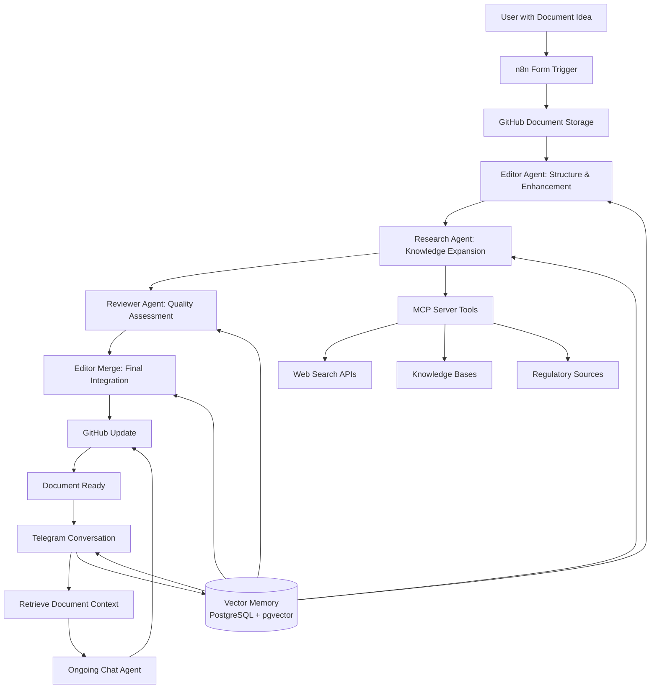
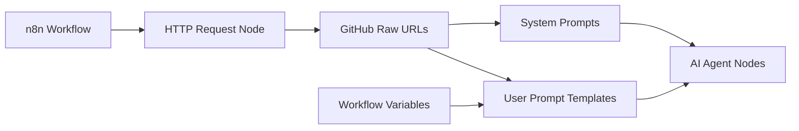
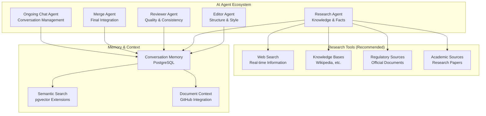

# Research Bug: Conversational Research Assistant & Writer

## Project Vision

Transform how people create, research, and refine documents by building an intelligent n8n workflow that acts as a conversational research assistant and writer. The system takes markdown documents, enhances them through multi-agent AI collaboration, and maintains ongoing conversations to iteratively improve content over time.

**Primary Deliverable**: A complete n8n workflow JSON file ready for import into any self-hosted n8n instance.

## Core Concept

**Starting Point**: You have an idea and some initial markdown content  
**Goal**: Create a sophisticated document through collaborative AI research and writing  
**Method**: Small, systematic improvements through conversation  
**Storage**: GitHub for version control and document persistence  
**Memory**: Conversation context maintained across sessions  
**Scope**: One document workflow - focus and simplicity over complexity

## System Architecture



### MCP Tooling Strategy
- MCP tools are integral to research and retrieval. Use only self-hostable or free-tier servers.
- Initial candidates (kept minimal for MVP):
  - Firecrawl (self-hostable crawling and extraction)
  - Searxng (self-hosted meta-search; default web search backend)
- MCP integrations must be toggleable per environment.
- Research sources should avoid social media platforms; prefer authoritative/documented sources.
- Citations are inline and URL-only unless otherwise specified by the document template.

## n8n Workflow Requirements

### Core Workflow Structure
The n8n workflow should contain these essential node types:
- **Form Trigger**: Document submission interface
- **AI Agent Nodes**: Multi-agent processing (Editor, Research, Reviewer, Merge, Ongoing Chat)
- **Memory Buffer Window**: Conversation persistence across sessions
- **PostgreSQL (pgvector) Operations**: Store and query embeddings via n8n PostgreSQL node(s)
- **GitHub Integration**: File creation and updates
- **Telegram Integration**: Ongoing conversation interface and event-based passive notifications (quiet controlled by user device settings)
- **HTTP Request Nodes**: Prompt template retrieval
- **Function/Set Nodes**: Data transformation and validation

### Prompt System Architecture


**Prompt Hosting Strategy**:
- System prompts embedded directly in AI Agent nodes
- User prompt templates fetched via HTTP from GitHub raw URLs
- Variable substitution using n8n's `{{$json.variable}}` syntax
- Dynamic prompt construction based on workflow state
- Repository-backed prompts are updated via pull requests; avoid editing prompts directly inside the workflow beyond minimal system scaffolding.

## Technical Architecture Details

### Multi-Agent System


### Data Flow & Storage Strategy
- **GitHub**: Primary document storage with version control
- **PostgreSQL with pgvector**: Conversation memory and semantic search
- **n8n Native Tools**: Prioritize built-in nodes over custom JavaScript
- **Variable Management**: Clean parameter passing between workflow stages
- **Error Handling**: Graceful degradation with user notifications

## Project Structure Requirements

### Repository Organization
Note: The workflow is imported into n8n and runs there; repository layout is optional scaffolding for templates and examples and is not required at runtime.
```
project-root/
├── workflow/
│   └── research-bug-workflow.json     # Main n8n workflow file
├── prompts/
│   ├── system/
│   │   ├── editor.md
│   │   ├── research.md
│   │   ├── reviewer.md
│   │   └── merge.md
│   └── user/
│       ├── form-initial.md
│       ├── telegram-ongoing.md
│       ├── research-task.md
│       ├── review-task.md
│       └── merge-final.md
├── docs/
│   ├── setup-guide.md
│   ├── credential-checklist.md
│   └── testing-procedures.md
└── examples/
    ├── sample-document.md
    └── sample-submission-brief.md
```

### GitHub Document Storage Structure
```
documents-repository/
├── documents/
│   ├── project-name-1.md
│   ├── project-name-2.md
│   └── ...
├── conversations/
│   ├── conversation-id-1.json
│   ├── conversation-id-2.json
│   └── ...
└── templates/
    ├── document-template.md
    └── submission-brief-template.md
```

## Credential Requirements & Setup

### Essential API Credentials
1. **LLM & Embeddings Provider (via n8n credentials)**
   - Purpose: AI agent processing and embeddings (provider-agnostic)
   - Required scopes: As per chosen provider
   - Usage: Configurable per agent; high volume for document processing

2. **GitHub API**
   - Purpose: Document storage and prompt retrieval
   - Required scopes: Repository read/write access
   - Usage: File operations for each document update

3. **Telegram Bot API**
   - Purpose: Ongoing conversation interface
   - Required scopes: Bot messaging and webhook access
   - Usage: Real-time conversation management

### Recommended Research APIs
4. **Web Search API**
   - Default: Self-hosted Searxng
   - Purpose: Real-time information gathering
   - Usage: Research agent knowledge expansion

5. **Knowledge Base APIs** (e.g., Wikipedia)
   - Purpose: Factual information and citations
   - Usage: Research validation and reference building

### Database Requirements
6. **PostgreSQL with pgvector**
   - Purpose: Conversation memory and semantic search
   - Required extensions: pgvector for embeddings
   - Schema: Conversation tables with vector similarity support

### Conversation Memory Architecture
- Separate PostgreSQL instance for chat memory used by the n8n LLM Agent memory.
- Retention policy: Store all messages; retrieval is capped by a configurable window (default 10 most relevant/most recent as appropriate).
- Embeddings are stored in PostgreSQL with pgvector; similarity search used for context retrieval bound to the current document.

### n8n Credential Setup Checklist
```
□ LLM & Embeddings credentials (provider-agnostic)
□ GitHub API - Repository access token
□ Telegram Bot - Bot token and webhook setup
□ PostgreSQL - Database connection with pgvector
□ Web Search API - Research tool access (optional)
□ Knowledge APIs - Wikipedia or similar (optional)
□ Webhook URLs - Form and Telegram endpoints configured
```

## Implementation Approach

### Phase 1: Core Workflow (MVP)
1. **Form submission and GitHub storage**
   - Basic form trigger with essential fields
   - GitHub file creation workflow
   - Simple document structure validation

2. **Single-agent processing**
   - Basic editor agent for document enhancement
   - Simple prompt system with embedded prompts
   - Direct GitHub updates without validation

3. **Basic conversation interface**
   - Telegram trigger setup
   - Simple ongoing chat functionality
   - Basic document retrieval and updates

### Phase 2: Multi-Agent Enhancement
1. **Research agent integration**
   - Web search tool integration
   - Citation management and fact-checking
   - Research addendum generation

2. **Quality assurance agents**
   - Reviewer agent for consistency checking
   - Merge agent for final integration
   - Validation and error handling

3. **Advanced conversation memory**
   - PostgreSQL integration with conversation storage
   - Vector similarity search for context retrieval
   - Session persistence across conversations

### Phase 3: Advanced Features
1. **Semantic search capabilities**
   - pgvector integration for document relationships
   - Advanced context retrieval
   - Cross-document knowledge sharing

2. **Research tool expansion**
   - Multiple research API integrations
   - Specialized knowledge base access
   - Regulatory and compliance checking

3. **Workflow optimization**
   - Performance improvements
   - Advanced error handling
   - Quality scoring and metrics

## Important Implementation Considerations

### 1. Conversation Design Philosophy
- **Single Document Focus**: One document workflow for clarity and performance
- **Small Steps**: Users make single, focused requests for iterative improvement
- **Clarifying Questions**: AI asks for clarification when direction is ambiguous
- **Document Context**: Always work with current document state
- **Progressive Enhancement**: Build complexity over time through conversation

### 2. Quality & Accuracy Priorities
- **Accuracy Over Speed**: Thorough processing preferred over rapid response
- **Multiple Validation Layers**: Editor, Research, Reviewer, and Merge agents
- **Source Verification**: Cross-reference multiple authoritative sources
- **Tone Preservation**: Maintain author's voice throughout enhancement process
- **Structure Standards**: Professional markdown formatting with proper hierarchy

### 3. Research Integration Strategy
- **Configurable Memory**: Large conversation windows for complex document work
- **Real-time Sources**: Current web information through research APIs
- **Authoritative Data**: Access to regulatory and official sources when needed
- **Citation Standards**: Proper link management and attribution
- **Fact Verification**: Cross-reference information across multiple sources

### 4. Technical Implementation Guidelines
- **n8n Native Approach**: Use built-in nodes and tools rather than custom JavaScript
- **Variable Management**: Clean parameter passing using n8n variable system
- **Error Handling**: Graceful degradation with informative user notifications
- **Memory Management**: Efficient conversation storage with configurable retention
- **API Rate Limiting**: Respectful usage of external research APIs
- **Provider-Agnostic LLMs**: Each agent can be assigned its own LLM via n8n's generic LLM/AI nodes; avoid provider-specific blocks to keep configuration easy to change.

### 5. Node Versioning & Docs Alignment
- Use the most up-to-date n8n nodes and configuration per official docs:
  - n8n nodes-base: https://github.com/n8n-io/n8n/tree/master/packages/nodes-base
  - Context7 docs index: https://context7.com/?q=n8n
- Acceptance criterion: Each node’s configuration is verified against current documentation during implementation and test.

## Success Metrics & Validation

### Document Quality Indicators
- **Structure Score**: Proper heading hierarchy and organization
- **Completeness Score**: Comprehensive coverage of requested topics
- **Citation Quality**: Authoritative sources with proper attribution
- **Readability**: Clear, accessible language appropriate for target audience
- **Enhancement Value**: Measurable improvement from initial to final document

### Workflow Performance
- **Processing Reliability**: Consistent successful completion of document enhancement
- **Memory Accuracy**: Relevant context retrieval across conversation sessions
- **Research Quality**: Accurate, current information integration
- **User Experience**: Intuitive conversation flow and clear feedback

### Technical Validation
- **Import Success**: Clean workflow import into fresh n8n instances
- **Credential Setup**: Straightforward API configuration process
- **Error Recovery**: Graceful handling of API failures and user errors
- **Scalability**: Efficient resource usage for large documents and long conversations

### Acceptance Criteria (MVP)
- Workflow imports cleanly into a fresh n8n instance with no missing nodes.
- Searxng endpoint configured and used by Research agent for web results.
- MCP servers configurable and minimal (at least Firecrawl + Searxng), toggleable per environment.
- Conversation memory persists via PostgreSQL + pgvector; retrieval works across sessions with default cap 10.
- Prompts are pulled from the repo via HTTP for user templates; system prompts embedded for scaffolding only.
- Telegram sends conversational messages and event-based passive progress notifications; quiet is governed by the user’s device settings.
- All nodes verified against latest n8n docs and Context7 index.
- Each agent can have its own LLM assigned via provider-agnostic n8n nodes (no provider-specific lock-in).

## Non-Goals
- Building beyond single-document workflows for MVP
- Custom UI beyond n8n Form + Telegram conversation
- Integrations requiring paid/closed APIs without self-hosted or free-tier alternatives for MVP

## Testing Strategy (Import-Friendly)

### Workflow Validation
- **Node Connectivity**: Verify all workflow paths function correctly
- **Credential Testing**: Validate each API integration independently
- **Memory Operations**: Test conversation persistence and retrieval
- **Document Processing**: End-to-end document enhancement validation

### Flexible Testing Approach
- **Modular Testing**: Test individual agents and components separately
- **Sample Data**: Provide test documents and expected outcomes
- **Configuration Validation**: Verify setup steps produce working environment
- **User Acceptance**: Test conversation flow from user perspective

## Getting Started

### For Implementers
1. **Set up n8n instance** with required database support
2. **Configure API credentials** using the credential checklist
3. **Import workflow JSON** into n8n workspace
4. **Set up GitHub repository** with recommended structure
5. **Deploy prompt templates** to GitHub for HTTP retrieval
6. **Test basic workflow** with sample document
7. **Configure conversation memory** with PostgreSQL and pgvector
8. **Validate research tools** and citation management
9. **Test end-to-end flow** from form submission to conversation

### For Users
1. **Access the n8n form** with project details and initial content
2. **Describe research requirements** in submission brief
3. **Submit for AI enhancement** and await processing completion
4. **Begin conversation via Telegram** for iterative improvements
5. **Make focused requests** for specific document enhancements
6. **Review changes** and provide feedback for further refinement

---

*This project represents a new paradigm in document creation, combining the power of AI agents, conversational interfaces, and systematic research to transform ideas into comprehensive, well-researched documents. The focus on n8n workflow delivery ensures maximum compatibility and ease of deployment across different environments.*
